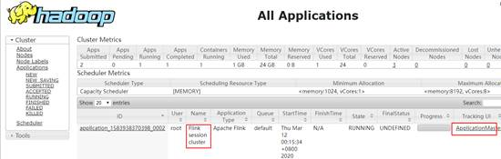
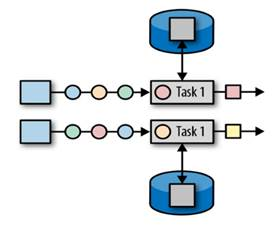
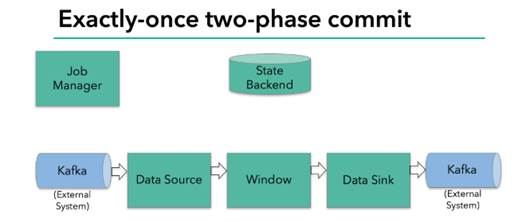

 

 

 

 

 

 

**大厂学苑-大数据&人工智能**

**Flink**

 

 

版本：V1.0

 

 

 

 

 

 

# 第1章 Flink概述

## 1.1 Flink简述

Apache Flink是一个框架和分布式处理引擎，用于对无界和有界数据流进行有状态计算。核心是一个分布式、高性能、高可用、实时性的流式计算框架

Flink起源于Stratosphere项目, 2014年4月Stratosphere的代码被复制并捐赠给了Apache软件基金会, 2014年12月，Flink一跃成为Apache软件基金会的顶级项目。

Spark和Flink都是分布式计算引擎，但是，Spark 和 Flink 一开始都拥有着同一个梦想，他们都希望能够用同一个技术把流处理和批处理统一起来，但他们走了完全不一样的两条路前者是以批处理的技术为根本，并尝试在批处理之上支持流计算；后者则认为流计算技术是最基本的，在流计算的基础之上支持批处理。正因为这种架构上的不同，今后二者在能做的事情上会有一些细微的区别。比如在低延迟场景，Spark 基于微批处理的方式需要同步会有额外开销，因此无法在延迟上做到极致。在大数据处理的低延迟场景，Flink 已经有非常大的优势。

Spark和Flink的主要差别就在于计算模型不同。Spark采用了微批处理模型，而Flink采用了基于操作符的连续流模型。因此，对Apache Spark和Apache Flink的选择实际上变成了计算模型的选择，而这种选择需要在延迟、吞吐量和可靠性等多个方面进行权衡。

Ø **批处理**的特点是有界、持久、大量，非常适合需要访问全套记录才能完成的计算工作，一般用于需要长时间运行的离线统计。在Spark的世界观中，一切都是由批次组成的，离线数据是一个大批次，而实时数据是由一个一个无限的小批次组成的。

Ø **流处理**的特点是无界、实时, 无需针对整个数据集执行操作，而是对通过系统传输的每个数据项执行操作，一般用于延迟小的实时统计。在Flink的世界观中，一切都是由流组成的，离线数据是有界限的流，实时数据是一个没有界限的流，

Ø **无界数据流**：无界数据流有开始但是没有结束，必须在获取流数据后立即处理。对于无界数据流我们无法等待所有数据都到达，因为输入是无界的，并且在任何时间点都不会完成。处理无界数据通常要求以特定顺序（例如事件发生的顺序）获取数据，以便能够推断结果完整性。

Ø **有界数据流**：有界数据流有明确定义的开始和结束，可以在执行任何计算之前通过获取指定范围内所有数据来处理有界流，处理有界流不需要有序获取，因为可以对在指定范围内的有界数据集进行排序后再处理，有界流的处理也称为批处理。

如果企业中非要技术选型从Spark和Flink这两个主流框架中选择一个来进行流数据处理，我们推荐使用Flink，主（显而）要（易见）的原因为：

l Flink灵活的窗口

l Exactly Once语义保证

这两个原因可以大大的解放程序员, 加快编程效率, 把本来需要程序员花大力气手动完成的工作交给框架完成，棒棒哒，点赞！！！

阿里公司在2015年改进Flink，并创建了内部分支Blink，目前服务于阿里集团内部搜索、推荐、广告和蚂蚁等大量核心实时业务。

## 1.2 Flink优势

Ø 目前唯一同时支持高吞吐、低延迟、高性能的分布式流式数据处理框架

Ø 支持事件事件概念

Ø 支持有状态计算，保持了事件原本产生的时序性，避免网络传输带来的影响

Ø 支持高度灵活的窗口操作，Flink将窗口分为Time、Count、Session以及Data-driven等类型的窗口操作，可以灵活的处罚条件定制化来达到对复杂的流传输模式的支持。

Ø 基于轻量级分布式快照实现容错，大型计算任务的流程拆解成小的计算过程，task分布到并行节点上处理。基于分布式快照技术的Checkpoints，将执行过程中的状态信息进行持久化存储，可以自动恢复出现异常的任务。

Ø 基于JVM实现独立的内存管理

## 1.3 Flink应用场景

Ø 实时智能推荐

Ø 复杂事件处理

Ø 实时欺诈检测

Ø 实时数仓与ETL

Ø 流数据分析

Ø 实时报表分析

 

# 第2章 Flink快速上手

**环境准备**

Ø JDK版本必须在1.8及以上

Ø Maven版本必须在3.0.4及以上

Ø Hadoop环境支持hadoop2.4、2.6、2.7、2.8等主要版本

## 2.1 创建Maven项目

Flink早期是由Java开发的，但是随着Spark中Scala函数式编程语言的盛行，Flink也采用Scala实现了相应的API，但是底层核心代码70%还是由Java语言开发的。目前企业里面主要以Java开发为主，所以本课件接下来的开发所使用的语言也为Java。本课件基于最新的Flink1.13.1版本，使用时请注意对应版本。

**修改****Maven****项目中的****POM****文件**

<properties>

  <project.build.sourceEncoding>UTF-8</project.build.sourceEncoding>

  <flink.version>1.13.1</flink.version>

  <java.version>1.8</java.version>

  <scala.binary.version>2.12</scala.binary.version>

  <maven.compiler.source>${java.version}</maven.compiler.source>

  <maven.compiler.target>${java.version}</maven.compiler.target>

  <log4j.version>2.12.1</log4j.version>

</properties>

 

<dependencies>

  <dependency>

​    <groupId>org.apache.flink</groupId>

​    <artifactId>flink-java</artifactId>

​    <version>${flink.version}</version>

  </dependency>

  <dependency>

​    <groupId>org.apache.flink</groupId>

   <artifactId>flink-streaming-java_${scala.binary.version}</artifactId>

​    <version>${flink.version}</version>

  </dependency>

  <dependency>

​    <groupId>org.apache.flink</groupId>

​    <artifactId>flink-clients_${scala.binary.version}</artifactId>

​    <version>${flink.version}</version>

  </dependency>

</dependencies>

## 2.2 批处理WordCount

package com.atguigu.itdachang.flink;

 

import org.apache.flink.api.common.functions.FlatMapFunction;

import org.apache.flink.api.java.ExecutionEnvironment;

import org.apache.flink.api.java.operators.AggregateOperator;

import org.apache.flink.api.java.operators.DataSource;

import org.apache.flink.api.java.operators.FlatMapOperator;

import org.apache.flink.api.java.operators.UnsortedGrouping;

import org.apache.flink.api.java.tuple.Tuple2;

import org.apache.flink.util.Collector;

 

public class Flink01_WC_Batch {

  public static void main(String[] args) throws Exception {

​    // 0.创建执行环境

​    ExecutionEnvironment env = ExecutionEnvironment.getExecutionEnvironment();

​    // 1.读取文件

​    DataSource<String> lineDS = env.readTextFile("input/word.txt");

​    // 2.转换数据格式

​    FlatMapOperator<String, Tuple2<String, Integer>> wordsAndOne = lineDS.flatMap(new FlatMapFunction<String, Tuple2<String, Integer>>() {

​      @Override

​      public void flatMap(String value, Collector<Tuple2<String, Integer>> out) throws Exception {

​        String[] words = value.split(" ");

​        for (String word : words) {

​          out.collect(new Tuple2<String, Integer>(word, 1));

​        }

​      }

​    });

 

​    // 3.按照word进行分组

​    UnsortedGrouping<Tuple2<String, Integer>> wordAndOneGS = wordsAndOne.groupBy(0);

 

​    // 4.分组内聚合统计

​    AggregateOperator<Tuple2<String, Integer>> sum = wordAndOneGS.sum(1);

 

​    // 5.打印结果

​    sum.print();

  }

}

Ø Flink在执行应用程序前应该获取执行环境对象，也就是上下文环境

ExecutionEnvironment env = ExecutionEnvironment.getExecutionEnvironment();

Ø Flink程序支持java和scala两种语言，本课程中以java语言为主。在引入包中，有java和scala两种包时注意要使用java的包

import org.apache.flink.api.java.***

Ø groupBy方法在聚合时不能使用分组选择器，只能采用位置索引或属性名称进行分组

// 使用索引定位

dataStream.groupBy(0)

// 使用类属性名称

dataStream.groupBy("id")

## 2.3 流处理WordCount

### 2.3.1 有界流

Ø 所谓的有界流就是有结束边界的流，比如文件

package com.atguigu.itdachang.flink;

 

import org.apache.flink.api.common.functions.FlatMapFunction;

import org.apache.flink.api.java.tuple.Tuple;

import org.apache.flink.api.java.tuple.Tuple2;

import org.apache.flink.streaming.api.datastream.DataStreamSource;

import org.apache.flink.streaming.api.datastream.KeyedStream;

import org.apache.flink.streaming.api.datastream.SingleOutputStreamOperator;

import org.apache.flink.streaming.api.environment.StreamExecutionEnvironment;

import org.apache.flink.util.Collector;

 

public class Flink02_WC_BoundedStream {

  public static void main(String[] args) throws Exception {

 

​    // 0.创建流式执行环境

​    StreamExecutionEnvironment env = StreamExecutionEnvironment.getExecutionEnvironment();

​    

​    // 1.读取文件

​    DataStreamSource<String> fileDS = env.readTextFile("input/word.txt");

​    

​    // 2.转换数据格式

​    SingleOutputStreamOperator<Tuple2<String, Integer>> wordAndOneTuple = fileDS.flatMap(new FlatMapFunction<String, Tuple2<String, Integer>>() {

​      @Override

​      public void flatMap(String value, Collector<Tuple2<String, Integer>> out) throws Exception {

​        String[] words = value.split(" ");

​        for (String word : words) {

​          out.collect(new Tuple2<String, Integer>(word, 1));

​        }

​      }

​    });

​    

​    // 3.分组

​    KeyedStream<Tuple2<String, Integer>, Tuple> wordAndOneKS = wordAndOneTuple.keyBy(0);

​    

​    // 4.求和

​    SingleOutputStreamOperator<Tuple2<String, Integer>> sum = wordAndOneKS.sum(1);

 

​    // 5.打印

​    sum.print();

​    

​    // 6.执行

​    env.execute();

  }

}

Ø Flink流处理中，使用的执行环境对象和批处理不一样

StreamExecutionEnvironment env = StreamExecutionEnvironment.getExecutionEnvironment();

Ø 对数据进行分组时，需要使用keyBy方法

KeyedStream<Tuple2<String, Integer>, Tuple> wordAndOneKS = wordAndOneTuple.keyBy(0);

Ø 在代码的最后，需要调用执行方法，否则流处理逻辑不会执行

env.execute();

### 2.3.2 无界流

Ø 所谓的无界流就是没有结束边界的流，如网络，消息队列

public class Flink03_WC_UnBoundedStream {

  public static void main(String[] args) throws Exception {

​    // 0. 获取执行环境

​    StreamExecutionEnvironment env = StreamExecutionEnvironment.getExecutionEnvironment();

 

​    // 1.从socket读取

​    DataStreamSource<String> socketDS = env.socketTextStream("localhost", 9999);

 

​    // 2.转换数据格式：压平、切分、转换成元组

​    SingleOutputStreamOperator<Tuple2<String, Integer>> wordAndOneTuple = socketDS.flatMap(

​        new FlatMapFunction<String, Tuple2<String, Integer>>() {

​          @Override

​          public void flatMap(String value, Collector<Tuple2<String, Integer>> out) throws Exception {

​            String[] words = value.split(" ");

​            for (String word : words) {

​              out.collect(new Tuple2<>(word, 1));

​            }

​          }

​        }

​    );

 

​     // 3.分组

​    KeyedStream<Tuple2<String, Integer>, Tuple> wordAndOneKS = wordAndOneTuple.keyBy(0);

 

​    // 4.求和

​    SingleOutputStreamOperator<Tuple2<String, Integer>> resultDS = wordAndOneKS.sum(1);

 

​    // 5.打印

​    resultDS.print();

​    

​    // 6.执行

​    env.execute();

  }

}

Ø 无界流表示无边界，所以可以使用Socket进行数据的采集

DataStreamSource<String> socketDS = 

env.socketTextStream("localhost", 9999);

Ø linux系统采用netcat进行数据输入: **nc -lk 9999**

# 第3章 Flink运行环境

Flink作为一个流数据处理框架和计算引擎，被设计在所有常见的集群环境中运行, 在国内工作中主流的环境为Yarn，不过逐渐容器式环境也慢慢流行起来。接下来，我们就分别看看不同环境下Flink的运行

## 3.1 Standalone模式

IDEA程序代码毕竟只是用来进行练习演示的，真实工作中还是要将应用程序打包提交到对应的集群中去执行，这里我们来看看只使用Flink自身节点运行的集群模式，也就是我们所谓的独立部署（Standalone）模式

### 3.1.1 解压缩文件

将flink-1.13.1-bin-scala_2.12.tgz文件上传到Linux并解压缩，放置在指定位置，路径中不要包含中文或空格

tar -zxvf flink-1.13.1-bin-scala_2.12.tgz -C /opt/module

mv flink-1.13.1 flink

### 3.1.2 修改配置文件

\1)   修改 conf/flink-conf.yaml 文件

jobmanager.rpc.address: linux1

\2)   修改 conf/workers文件

linux1

linux2

\3)  修改 conf/masters文件

linux1:8081

\4)  分发Flink到其他节点

xsync flink

### 3.1.3 启动Standalone环境

\1)  执行启动命令

bin/start-cluster.sh

\2)   访问Web UI对Flink集群和任务进行监控管理

http://linux1:8081

### 3.1.4 命令行提交应用程序

\1)  启动netcat

nc -lk 9999

\2)  执行脚本命令

bin/flink run -c com.atguigu.WordCount_unBoundedStream /opt/module/data/input/wordcount.jar

### 3.1.5 UI界面提交应用程序

\1)  准备数据文件

在flink目录下，创建input文件夹并增加word.txt文件，并增加内容

Hello Scala

Hello Spark

Hello Flink

\2)  将数据文件分发到不同的节点

xsync input

\3)  使用maven工具将之前的WordCount程序打包，然后在UI页面中提交

执行时，如果出现文件找不到的异常，可以在读取的文件路径前增加系统参数

System.getProperty("user.dir")

### 3.1.6 HA高可用

任何时候都有一个主JobManager 和多个备用JobManagers，以便在主节点失败时有备用 JobManagers 来接管集群。这保证了没有单点故障，一旦备用JobManager 接管集群，作业就可以正常运行。主备 JobManager 实例之间没有明显的区别。每个 JobManager 都可以充当主备节点。

\1)   修改conf/flink-conf.yaml配置文件

配置参数中冒号后面的参数值都需要增加空格

\# Line 81

high-availability: zookeeper

 

\# Line 90

high-availability.storageDir: hdfs://linux1:8020/flink/ha/

 

\# Line 96

high-availability.zookeeper.quorum: linux1:2282,linux2:2282,linux3:2282

\2)   修改conf/masters配置文件

linux1:8081

linux2:8081

\3)  修改zoo.cfg配置文件

\#Line 32 防止和外部ZK冲突

clientPort=2282

\#Line 35

server.88=linux1:2888:3888

server.89=linux2:2888:3888

server.90=linux3:2888:3888

\4)  分发配置文件

xsync conf

\5)   引入hadoop关联jar包：flink-shaded-hadoop-2-uber-3.1.3-9.0.jar

分发Jar包, 启动HDFS集群

\6)   启动Flink Zookeeper集群

bin/start-zookeeper-quorum.sh

\7)   启动Flink HA集群

bin/start-cluster.sh

\8)  启动成功后，分别访问地址

http://linux1:8081

http://linux2:8081

 

## 3.2 Yarn模式

独立部署（Standalone）模式由Flink自身提供计算资源，无需其他框架提供资源，这种方式降低了和其他第三方资源框架的耦合性，独立性非常强。但是你也要记住，Flink主要是计算框架，而不是资源调度框架，所以本身提供的资源调度并不是它的强项，所以还是和其他专业的资源调度框架集成更靠谱，所以接下来我们来学习在强大的Yarn环境中Flink是如何使用的。（其实是因为在国内工作中，Yarn使用的非常多）

以Yarn模式部署Flink任务时，要求Flink是有Hadoop支持的版本，Hadoop环境需要保证版本在2.2以上，并且集群中安装有HDFS服务。

### 3.2.1 解压缩文件

将flink-1.13.1-bin-scala_2.12.tgz文件上传到Linux并解压缩，放置在指定位置，路径中不要包含中文或空格

tar -zxvf flink-1.13.1-bin-scala_2.12.tgz -C /opt/module

mv flink-1.13.1 flink-yarn

### 3.2.2 启动Yarn环境

瞅啥呢，自己启动去！

### 3.2.3 命令行提交应用程序

bin/flink run -m yarn-cluster -c com.atguigu.WordCount_unBoundedStream /opt/module/data/input/wordcount.jar

提交时，会出现如下错误

错误的原因是Flink默认情况下类库中是不包含hadoop相关依赖的，所以提交时会发生错误，解决方案非常简单，引入hadoop相关依赖jar包即可：flink-shaded-hadoop-2-uber-3.1.3-9.0.jar

上传后，重新执行上面的指令即可。运行过程可以通过Yarn的应用服务页面查看

应用程序运行结束后，Yarn中的应用程序也自动结束

 

### 3.2.4 两种集群方式

**1)**   **Per-Job-Cluster**

在上面的应用程序提交时，一个Job会对应一个yarn-session集群，每提交一个作业会根据自身的情况，都会单独向yarn申请资源，直到作业执行完成，一个作业的失败与否并不会影响下一个作业的正常提交和运行。独享Dispatcher和ResourceManager，按需接受资源申请；适合规模大长时间运行的作业

这种方式每次提交都会创建一个新的flink集群，任务之间互相独立，互不影响，方便管理。任务执行完成之后创建的集群也会消失。

**2)**   **Session-Cluster**

在规模小执行时间短的作业执行时，频繁的申请资源并不是一个好的选择，所以Flink还提供了一种可以事先申请一定资源，然后在这个资源中并行执行多个作业的集群方式。

在yarn中初始化一个flink集群，开辟指定的资源，以后提交任务都向这里提交。这个flink集群会常驻在yarn集群中，除非手工停止。

Session-Cluster集群模式和Per-Job-Cluster不一样的是需要事先创建Yarn应用后再提交Flink应用程序。

Yarn会按需动态分配TaskManager和slot，其实-n -s参数已经失效。

bin/yarn-session.sh -d -n 2 -s 2 -jm 1024 -tm 1024 -nm test

| -n(--container) | TaskManager的数量                                            |
| --------------- | ------------------------------------------------------------ |
| -s(--slots)     | 每个TaskManager的slot数量，默认一个slot一个core，默认每个taskmanager的slot的个数为1，有时可以多一些taskmanager，做冗余 |
| -jm             | JobManager的内存（单位MB)                                    |
| -tm             | 每个Taskmanager的内存（单位MB)                               |
| -nm             | yarn 的appName(现在yarn的ui上的名字)                         |
| -d              | 后台执行,需要放在前面，否则不生效                            |

运行成功后，可以通过Yarn应用页面查看

### 3.2.5 HA高可用

\1)  配置yarn最大重试次数yarn-site.xml，分发文件

<property>

 <name>yarn.resourcemanager.am.max-attempts</name>

 <value>4</value>

</property>

\2)  修改conf/flink-conf.yaml配置文件

配置参数中冒号后面的参数值都需要增加空格

yarn.application-attempts: 4

\# Line 81

high-availability: zookeeper

 

\# Line 90

high-availability.storageDir: hdfs://linux1:8020/flink/ha/

 

\# Line 96

high-availability.zookeeper.quorum: linux1:2282,linux2:2282,linux3:2282

\3)  修改conf/master配置文件

linux1:8081

linux2:8081

linux3:8081

\4)  修改zoo.cfg配置文件

\#Line 32 防止和外部ZK冲突

clientPort=2282

\#Line 35

server.88=linux1:2888:3888

server.89=linux2:2888:3888

server.90=linux3:2888:3888

\5)   分发flink

xsync flink-yarn

\6)  启动Flink Zookeeper集群

bin/start-zookeeper-quorum.sh

\7)  启动Flink Session应用

bin/yarn-session.sh -d -n 1 -s 1 -jm 1024 -tm 1024 -nm test

如果此时将Cluster进程关闭，WebUI界面会访问不了

那么稍等后，Yarn会自动重新启动Cluster进程，就可以重新访问了。

 

# 第4章 Flink运行架构

## 4.1 运行架构

Flink架构体系基本上分三层（自顶向下）：API & Libraries层、Runtime核心层、物理部署层

Ø API & Libraries层： 提供支撑流计算和批计算的接口，同时在此基础上抽象出不同的应用类型的组件库

Ø Runtime核心层：Flink分布式计算框架的核心实现层，支持分布式Stream作业的执行、JobGraph到ExecutionGraph的映射转换、任务调度等。将DataStream和DataSet转成同意的可执行的Task Operator

Ø 物理部署层：目前Flink支持本地、集群、云、容器部署，Flink通过盖层能够支持不同平台的部署，用户可以根据需要选择使用对应的部署模式

Flink Runtime 层的主要架构如下图所示，它展示了一个 Flink 集群的基本结构。整体来说，它采用了标准 master-slave 的结构，master负责管理整个集群中的资源和作业；TaskManager 则是 Slave，负责提供具体的资源并实际执行作业

## 4.2 核心组件

**Application Master** 部分包含了三个组件:

**1)**  **Dispatcher**

负责接收用户提供的作业，并且负责为这个新提交的作业启动一个新的JobManager 组件

**2)**  **ResourceManager**

负责资源的管理，在整个Flink 集群中只有一个ResourceManager

**3)**    **JobManager**

负责管理作业的执行，在一个 Flink 集群中可能有多个作业同时执行，每个作业  都有自己的 JobManager 组件

**还有其他组件：**

**1)**    **TaskManager**

主要负责执行具体的task任务，从JobManager处接收需要部署的 Task，部署 启动后，与自己的上游建立连接，接收数据并处理。

**2)**    **Cluster Manager**

集群管理器，比如Standalone、YARN、K8s等，就是前面我们学习的不同环境

**3)**  **Client**

提交Job的客户端，可以是运行在任何机器上（与 JobManager 环境连通即可）。提交Job后，Client可以结束进程（Streaming的任务），也可以不结束并等待结果返回

## 4.3 核心概念

### 4.3.1 TaskManager与Slots 

Flink中每一个worker(TaskManager)都是一个JVM进程，它可能会在独立的线程上执行一个Task。为了控制一个worker能接收多少个task，worker通过Task Slot来进行控制（一个worker至少有一个Task Slot）。

这里的Slot如何来理解呢？很多的文章中经常会和Spark框架进行类比，将Slot类比为Core，其实简单这么类比是可以的，可实际上，可以考虑下，当Spark申请资源后，这个Core执行任务时有可能是空闲的，但是这个时候Spark并不能将这个空闲下来的Core共享给其他Job使用，所以这里的Core是Job内部共享使用的。接下来我们再回想一下，之前在Yarn Session-Cluster模式时，其实是可以并行执行多个Job的，那如果申请两个Slot，而执行Job时，只用到了一个，剩下的一个怎么办？那我们自认而然就会想到可以将这个Slot给并行的其他Job，对吗？所以Flink中的Slot和Spark中的Core还是有很大区别的。

每个task slot表示TaskManager拥有资源的一个固定大小的子集。假如一个TaskManager有三个slot，那么它会将其管理的内存分成三份给各个slot。资源slot化意味着一个task将不需要跟来自其他job的task竞争被管理的内存，取而代之的是它将拥有一定数量的内存储备。需要注意的是，这里不会涉及到CPU的隔离，slot目前仅仅用来隔离task的受管理的内存。

### 4.3.2 Parallelism（并行度）

所谓的并行度，其实就是计算时，可以同时执行任务的数量，比如进行转换操作的map算子设定并行度为2，那么就意味着在执行任务时需要形成并行的2个任务来执行。

l Flink的并行度设置可以在任何算子后使用，并且为了方便，也可以设置全局并行度

StreamExecutionEnvironment env =

  StreamExecutionEnvironment.getExecutionEnvironment();

env.setParallelism(2);

但是需要注意，某些数据源数据的采集是无法改变并行度，如Socket

l 如果Flink的一个算子的并行度为2，那么这个算子在执行时，这个算子对应的task就会拆分成2个subtask，发到不同的Slot中执行

一个特定算子的子任务（subtask）的个数被称之为其并行度（parallelism），一般情况下，一个流程序的并行度，可以认为就是其所有算子中最大的并行度。一个程序中，不同的算子可能具有不同的并行度。

Stream在算子之间传输数据的形式可以是one-to-one(forwarding)的模式也可以是redistributing的模式，具体是哪一种形式，取决于算子的种类。

Ø **One-to-one**：stream(比如在source和map operator之间)维护着分区以及元素的顺序。那意味着flatmap 算子的子任务看到的元素的个数以及顺序跟source 算子的子任务生产的元素的个数、顺序相同，map、fliter、flatMap等算子都是one-to-one的对应关系。

Ø **Redistributing**：stream(map()跟keyBy/window之间或者keyBy/window跟sink之间)的分区会发生改变。每一个算子的子任务依据所选择的transformation发送数据到不同的目标任务。例如，keyBy()基于hashCode重分区、broadcast和rebalance会随机重新分区，这些算子都会引起redistribute过程

### 4.3.3 Task与SubTask

Flink执行时,由于并行度的设置，可以将同一个Job不同算子的subtask放在同一块内存中进行处理，那么这样在执行时就可以合并成一个完整的task进行处理，而不是独立的子任务，这样就减少了子任务（SubTask）之间调度和数据传递的性能损耗

### 4.3.4 Operator Chains（任务链）

在Flink执行计算时，多个算子的subTask到底能不能组成一个Task是不确定的。比如读取并行度为1的数据源，但是map映射时使用并行度2，那么这样map算子就存在两个subtask，可是数据源读取时只有一个subtask，那么就会导致其中一个subtask无法链接成task，就需要在其他slot中执行。所以在这种情况下，到底哪些subtask可以组合，哪些subtask不能组合，就需要动态调整，这就需要用到一种任务链的操作进行设置。

任务链必须满足两个条件：**one-to-one****的数据传输并且并行度相同**

### 4.3.5 ExecutionGraph（执行图）

由Flink程序直接映射成的数据流图是StreamGraph，也被称为逻辑流图，因为它们表示的是计算逻辑的高级视图, 简单理解就是将整个流计算的执行过程用图形表示出来,这样更直观，更便于理解，所有用于表示程序的拓扑结构

虽然更便于理解，但是和真正执行还有差别的，因为到底什么样的subtask组合成一个完整的task，task之间如何将多个符合条件的节点 chain 在一起作为一个节点，这些还是不能直观的展示给我们，所以为了直观地观察一个流处理程序的执行，Flink还需要将逻辑流图转换为作业图 JobGraph，提交给 JobManager

JobManager 根据JobGraph生成ExecutionGraph。ExecutionGraph是JobGraph的并行化版本，是调度层最核心的数据结构

## 4.4 提交流程

我们来看看当一个应用提交执行时，Flink的各个组件是如何交互协作的：

任务提交和组件交互流程

上图是从一个较为高层级的视角，来看应用中各组件的交互协作。如果部署的集群环境不同（例如YARN，Mesos，Kubernetes，Standalone等），其中一些步骤可以被省略，或是有些组件会运行在同一个JVM进程中。

具体地，如果我们将Flink集群部署到YARN上，那么就会有如下的提交流程：

\1)  Flink任务提交后，Client向HDFS上传Flink的Jar包和配置

\2)  向Yarn ResourceManager提交任务，ResourceManager分配Container资源

\3)  通知对应的NodeManager启动ApplicationMaster，ApplicationMaster启动后加载Flink的Jar包和配置构建环境，然后启动JobManager

\4)  ApplicationMaster向ResourceManager申请资源启动TaskManager

\5)  ResourceManager分配Container资源后，由ApplicationMaster通知资源所在节点的NodeManager启动TaskManager

\6)  NodeManager加载Flink的Jar包和配置构建环境并启动TaskManager

\7)   TaskManager启动后向JobManager发送心跳包，并等待JobManager向其分配任务。

 

# 第5章 Flink核心编程

和其他所有的计算框架一样，flink也有一些基础的开发步骤以及基础，核心的API，从开发步骤的角度来讲，主要分为四大部分

接下来我们就分别看看每一部分是如何操作的。

## 5.1 Environment

Flink Job在提交执行计算时，需要首先建立和Flink框架之间的联系，也就指的是当前的flink运行环境，只有获取了环境信息，才能将task调度到不同的taskManager执行。而这个环境对象的获取方式相对比较简单

// 批处理环境

ExecutionEnvironment benv = ExecutionEnvironment.getExecutionEnvironment();

// 流式数据处理环境

StreamExecutionEnvironment env = StreamExecutionEnvironment.getExecutionEnvironment();

## 5.2 Source

Flink框架可以从不同的来源获取数据，将数据提交给框架进行处理, 我们将获取数据的来源称之为数据源。

准备一个WaterSensor类方便演示：

// 定义类：水位传感器：

// 传感器用于接收空气高度数据，传感器本身有设备安装高度，所以减去扫描的空气高度，就是当前水位高度。

// id:传感器编号

// ts:时间戳

// vc:空高

public class WaterSensor {

  private String id;

  private Long ts;

  private Integer vc;

 

  public Watersensor() {

  }

 

  public Watersensor(String id, Long ts, Integer vc) {

​    this.id = id;

​    this.ts = ts;

​    this.vc = vc;

  }

 

  public String getId() {

​    return id;

  }

 

  public void setId(String id) {

​    this.id = id;

  }

 

  public Long getTs() {

​    return ts;

  }

 

  public void setTs(Long ts) {

​    this.ts = ts;

  }

 

  public Integer getVc() {

​    return vc;

  }

 

  public void setVc(Integer vc) {

​    this.vc = vc;

  }

 

  @Override

  public String toString() {

​    return "WaterSensor{" +

​        "id='" + id + '\'' +

​        ", ts=" + ts +

​        ", vc=" + vc +

​        '}';

  }

}

### 5.2.1 从集合读取数据 

一般情况下，可以将数据临时存储到内存中，形成特殊的数据结构后，作为数据源使用。这里的数据结构采用集合类型是比较普遍的。

public class Flink04_Source_Collection {

  public static void main(String[] args) throws Exception {

​    // 0.创建执行环境

​    StreamExecutionEnvironment env = StreamExecutionEnvironment.getExecutionEnvironment();

​    env.setParallelism(1);

 

​    // 1.从集合中读取数据

​    DataStreamSource<WaterSensor> collectionDS = env.fromCollection(

​        Arrays.asList(

​            new WaterSensor("ws_001", 1577844001L, 45),

​            new WaterSensor("ws_002", 1577844015L, 43),

​            new WaterSensor("ws_003", 1577844020L, 42)

​        )

​    );

 

​    // 2.打印

​    collectionDS.print();

 

​    // 3.执行

​    env.execute();

  }

}

 

### 5.2.2 从文件读取数据 

通常情况下，我们会从存储介质中获取数据，比较常见的就是将日志文件作为数据源

public class Flink05_Source_File {

  public static void main(String[] args) throws Exception {

​    // 0.创建执行环境

​    StreamExecutionEnvironment env = StreamExecutionEnvironment.getExecutionEnvironment();

​    env.setParallelism(1);

 

​    // 1.从集合中读取数据

​    DataStreamSource<String> fileDS = env.readTextFile("input/sensor-data.log");

 

​    // 2.打印

​    fileDS.print();

 

​    // 3.执行

​    env.execute();

  }

}

在读取文件时，文件路径可以是目录也可以是单一文件。如果采用相对文件路径，会从当前系统参数user.dir中获取路径

System.getProperty("user.dir")

如果在IDEA中执行代码，系统参数user.dir自动指向**项目根目录**，如果是standalone集群环境, 默认为集群节点根目录，当然除了相对路径以外，也可以将路径设置为分布式文件系统路径，如HDFS

DataStreamSource<String> fileDS =

 env.readTextFile( "hdfs://linux1:8020/test/1.txt")

默认读取时，flink的依赖关系中是不包含Hadoop依赖关系的，所以执行上面代码时，会出现错误。

解决方法就是增加相关依赖jar包(flink-shaded-hadoop-2-uber-3.1.3-9.0.jar)就可以了

### 5.2.3 从Kafka读取数据 

Kafka作为消息传输队列，是一个分布式的，高吞吐量，易于扩展地基于主题发布/订阅的消息系统。在现今企业级开发中，Kafka 和 Flink 成为构建一个实时的数据处理系统的首选

 

\1)    引入kafka连接器的依赖

<dependency>

  <groupId>org.apache.flink</groupId>

  <artifactId>flink-connector-kafka_${scala.binary.version}</artifactId>

  <version>${flink.version}</version>

</dependency>

\2)  代码实现参考

import org.apache.flink.streaming.api.datastream.DataStreamSource;

import org.apache.flink.streaming.api.environment.StreamExecutionEnvironment;

import org.apache.flink.streaming.connectors.kafka.FlinkKafkaConsumer;

import org.apache.flink.api.common.serialization.SimpleStringSchema;

 

import java.util.Properties;

 

public class Flink06_Source_Kafka {

  public static void main(String[] args) throws Exception {

​    // 0.创建执行环境

​    StreamExecutionEnvironment env = StreamExecutionEnvironment.getExecutionEnvironment();

​    env.setParallelism(1);

 

​    // 1.从kafka中读取

​    Properties properties = new Properties();

​    properties.setProperty("bootstrap.servers", "linux1:9092");

​    properties.setProperty("group.id", "consumer-group");

​    properties.setProperty("key.deserializer", "org.apache.kafka.common.serialization.StringDeserializer");

​    properties.setProperty("value.deserializer", "org.apache.kafka.common.serialization.StringDeserializer");

​    properties.setProperty("auto.offset.reset", "latest");

 

​    DataStreamSource<String> kafkaDS = env.addSource(

​        new FlinkKafkaConsumer<String>(

​            "flink-test",

​            new SimpleStringSchema(),

​            properties)

​    );

 

​    kafkaDS.print("kafka source");

 

​    env.execute();

  }

}

### 5.2.4 自定义数据源 

大多数情况下，前面的数据源已经能够满足需要，但是难免会存在特殊情况的场合，所以flink也提供了能自定义数据源的方式

\1)  创建自定义数据源

public static class MySource implements SourceFunction<WaterSensor> {

  private volatile boolean flag = true;

  @Override

  public void run(SourceContext<WaterSensor> ctx) throws Exception {

​    Random random = new Random();

​    while (flag) {

​      ctx.collect(

​          new WaterSensor(

​              "sensor_" + (random.nextInt(3) + 1),

​              System.currentTimeMillis(),

​              random.nextInt(10) + 40

​          )

​      );

​      Thread.sleep(1000L);

​    }

  }

 

  @Override

  public void cancel() {

​    flag = false;

  }

}

\2)  代码实现参考

StreamExecutionEnvironment env = StreamExecutionEnvironment.getExecutionEnvironment();

env.setParallelism(1);

 

DataStreamSource<WaterSensor> inputDS = env.addSource(new MySource());

 

inputDS.print();

 

env.execute();

## 5.3 Transform

Flink中可以将一个数据流转换为其他的数据流，转换过程中，数据流的类型也会发生变化，那么到底Flink支持什么样的数据类型呢，其实我们常用的数据类型，Flink都是支持的。比如：Long, String, Integer, Int, 元组，样例类，List, Map等。

Ø 原生数据类型

Flink通过实现BasicTypeInfo数据类型，能够支持任意Java原生基本类型(装箱)或String类型，例如Integer、String、Double等

Ø Java Tuples类型

Flink通过定义TupleTypeInfo来描述Tuple类型数据

Ø POJOs类型

l Flink通过PojoTypeInfo来描述任意的POJOs，包括Java和Scala类

l POJOs类必须是public修饰且必须独立定义，不能是内部类

l POJOs类中必须含有默认构造器

l POJOs类中所有的Fields必须是Public或者具有普Public修饰的getter和setter方法

l POJOs类中的字段必须是Flink支持的

Ø Flink Value类型

Value数据类型实现了org.apache.flink.types.Value，其中包括read()和write()两个方法完成序列化和反序列化操作，相对于通用的序列化工具会有着比较高效的性能。Flink提供的内建Value类型有IntValue、DoubleValue、StringValue等

Ø 特殊数据类型

l Scala中的List、Map、Either、Option、Try数据类型

l Java中Either

l Hadoop的Writable数据类型

### 5.3.1 map

Ø 映射：将数据流中的数据进行转换, 形成新的数据流，消费一个元素并产出一个元素

Ø 参数：lambda表达式或MapFunction实现类

Ø 返回：DataStream

// lambda表达式

StreamExecutionEnvironment env = StreamExecutionEnvironment.getExecutionEnvironment();

env.setParallelism(1);

 

final DataStreamSource<List<String>> listDataStreamSource = env.fromElements(

  Arrays.asList(

​    "Hello",

​    "Hello",

​    "Hello"

  )

);

 

final SingleOutputStreamOperator<Tuple2> map = listDataStreamSource.map(

  d -> {

​    return new Tuple2(d, 1);

  }

);

 

map.print();

 

env.execute();

 

// 函数类

StreamExecutionEnvironment env = StreamExecutionEnvironment.getExecutionEnvironment();

env.setParallelism(1);

 

final DataStreamSource<String> listDataStreamSource = env.fromElements(

  "Hello",

  "Hello",

  "Hello"

);

 

final SingleOutputStreamOperator<Tuple2<String, Integer>> map = listDataStreamSource.map(

​    new MapFunction<String, Tuple2<String, Integer>>() {

​      @Override

​      public Tuple2<String, Integer> map(String s) throws Exception {

​        return new Tuple2<String, Integer>(s, 1);

​      }

​    }

);

 

map.print();

 

env.execute();

Flink在使用各种不同算子的同时，为了能更细粒度的控制数据和操作数据，给开发者提供了对现有函数功能进行扩展的能力，这就是函数类（FunctionClasses）。也可以简单地理解为UDF函数（用户自定义函数）

l Flink每一个算子的参数都可以使用lambda表达式和函数类两种的方式，其中如果使用函数类作为参数的话，需要让自定义函数继承指定的父类或实现特定的接口。例如：MapFunction

// 自定义映射转换函数

// 1.实现MapFunction接口，并定义泛型（输入，输出）

// 2.实现方法

public static class MyMapFunction implements MapFunction<String,WaterSensor>{

​    @Override

​    public WaterSensor map(String value) throws Exception {

​      String[] datas = value.split(",");

​      return new WaterSensor(datas[0], Long.valueOf(datas[1]), Integer.valueOf(datas[2]));

​    }

}

l  所有Flink函数类都有其Rich版本。它与常规函数的不同在于，可以获取运行环境的上下文，并拥有一些生命周期方法，所以可以实现更复杂的功能。也有意味着提供了更多的，更丰富的功能。例如：RichMapFunction

public static class MyRichMapFunction extends RichMapFunction<String, WaterSensor> {

​    @Override

​    public WaterSensor map(String value) throws Exception {

​      String[] datas = value.split(",");

​      return new WaterSensor(datas[0], Long.valueOf(datas[1]), Integer.valueOf(datas[2]));

​    }

 

​    @Override

​    public void open(Configuration parameters) throws Exception {

​      System.out.println("open....");

​    }

 

​    @Override

​    public void close() throws Exception {

​      System.out.println("close....");

​    }

}

**Rich Function****有一个生命周期的概念。典型的生命周期方法有：**

Ø open()方法是rich function的初始化方法，当一个算子例如map或者filter被调用之前open()会被调用

Ø close()方法是生命周期中的最后一个调用的方法，做一些清理工作

Ø getRuntimeContext()方法提供了函数的RuntimeContext的一些信息，例如函数执行的并行度，任务的名字，以及state状态

### 5.3.2 flatMap

Ø 扁平映射：将数据流中的整体拆分成一个一个的个体使用，消费一个元素并产生零到多个元素

Ø 参数：lambda表达式或FlatMapFunction实现类

Ø 返回：DataStream

 

SingleOutputStreamOperator<Integer> resultDS = inputDS.flatMap(

​        new FlatMapFunction<List<Integer>, Integer>() {

​          @Override

​          public void flatMap(List<Integer> value, Collector<Integer> out) throws Exception {

​            for (Integer element : value) {

​              out.collect(element);

​            }

​          }

​        }

);

### 5.3.3 filter

Ø 过滤：根据指定的规则将满足条件（true）的数据保留，不满足条件(false)的数据丢弃

Ø 参数：Scala匿名函数或FilterFunction

Ø 返回：DataStream

 

SingleOutputStreamOperator<Integer> filterDS = inputDS.filter(new FilterFunction<Integer>() {

​      @Override

​      public boolean filter(Integer value) throws Exception {

​        return value > 5;

​      }

​    }

);

### 5.3.4 keyBy

根据指定的key对数据进行分流

Ø 分流：根据指定的Key的hashcode将元素发送到不同的分区，相同的Key会被分到一个分区（这里分区指的就是下游算子多个并行节点的其中一个）。keyBy()是通过哈希来分区的

Ø 参数：Scala匿名函数或POJO属性或元组索引，不能使用数组

Ø 返回：**KeyedStream**

 

KeyedStream<Tuple2<String,Integer>, Tuple> streamKeyby = stream.keyBy(0);

### 5.3.5 shuffle

Ø 打乱重组（洗牌）：将数据随机分布打散到下游

Ø 参数：无

Ø 返回：DataStream

 

DataStream<String> streamShuffle = stream.shuffle();

### 5.3.6 split

在某些情况下，我们需要将数据流根据某些特征拆分成两个或者多个数据流，给不同数据流增加标记以便于从流中取出。**最新版本中已删除，推荐用keyBy的方式进行窗口处理或SideOutput侧输出流处理**

### 5.3.7 select

将数据流进行分流后，如何从流中将不同的标记取出呢，这时就需要使用select算子了。**最新版本中已删除，推荐用keyBy的方式进行窗口处理或SideOutput侧输出流处理**

 

### 5.3.8 connect

在某些情况下，我们需要将两个不同来源的数据流进行连接，实现数据匹配，比如订单支付和第三方交易信息，这两个信息的数据就来自于不同数据源，连接后，将订单支付和第三方交易信息进行对账，此时，才能算真正的支付完成。

Flink中的connect算子可以连接两个保持他们类型的数据流，两个数据流被Connect之后，只是被放在了一个同一个流中，内部依然保持各自的数据和形式不发生任何变化，两个流相互独立。

 

DataStreamSource<Integer> numDS = env.fromCollection(Arrays.asList(1, 2, 3, 4));

ConnectedStreams<WaterSensor, Integer> resultCS = sensorDS.connect(numDS);

### 5.3.9 union

对两个或者两个以上的DataStream进行union操作，产生一个包含所有DataStream元素的新DataStream

 

DataStreamSource<Integer> numDS1 = env.fromCollection(Arrays.asList(1, 2, 3, 4));

DataStreamSource<Integer> numDS2 = env.fromCollection(Arrays.asList(5, 6, 7, 8));

DataStreamSource<Integer> numDS3 = env.fromCollection(Arrays.asList(9, 10));

 

DataStream<Integer> unionDS = numDS1

​     .union(numDS2)

​     .union(numDS3);

 

unionDS.print()

**connect****与** **union** **区别：**

\1)    union之前两个流的类型必须是一样，connect可以不一样

\2)    connect只能操作两个流，union可以操作多个。

## 5.4 Operator

Flink作为计算框架，主要应用于数据计算处理上，所以在keyBy对数据进行分流后，可以对数据进行相应的统计分析

### 5.4.1 滚动聚合算子（Rolling Aggregation）

这些算子可以针对**KeyedStream**的每一个支流做聚合。执行完成后，会将聚合的结果合成一个流返回，所以结果都是**DataStream**

Ø sum()

Ø min()

Ø max()

### 5.4.2 reduce

一个分组数据流的聚合操作，合并当前的元素和上次聚合的结果，产生一个新的值，返回的流中包含每一次聚合的结果，而不是只返回最后一次聚合的最终结果。

// 0.创建执行环境

StreamExecutionEnvironment env = StreamExecutionEnvironment.getExecutionEnvironment();

env.setParallelism(2);

 

// 1.读取数据

SingleOutputStreamOperator<WaterSensor> sensorDS = env.fromElements(

​    new WaterSensor("ws2", 11111L, 1),

​    new WaterSensor("ws1", 11111L, 1),

​    new WaterSensor("ws2", 11111L, 1),

​    new WaterSensor("ws1", 11111L, 1),

​    new WaterSensor("ws2", 11111L, 1),

​    new WaterSensor("ws1", 11111L, 1),

​    new WaterSensor("ws1", 11111L, 1),

​    new WaterSensor("ws2", 11111L, 1),

​    new WaterSensor("ws1", 11111L, 1),

​    new WaterSensor("ws1", 11111L, 1)

);

 

// 2.转换成元组

final SingleOutputStreamOperator<Tuple2<String, Integer>> map = sensorDS.map(

  d -> new Tuple2<String, Integer>(d.getId(), d.getVc())

).returns(new TypeHint<Tuple2<String, Integer>>() {});

 

 

// 3.按照id分组

final KeyedStream<Tuple2<String, Integer>, String> tuple2StringKeyedStream = map.keyBy(t -> t.f0);

 

// 4.聚合

final SingleOutputStreamOperator<Tuple2<String, Integer>> reduce = tuple2StringKeyedStream.reduce(

  (t1, t2) -> {

​    return new Tuple2<String, Integer>(t1.f0, t1.f1 + t2.f1);

  }

);

 

reduce.print("reduce");

 

env.execute();

### 5.4.3 process

Flink在数据流通过keyBy进行分流处理后，如果想要处理过程中获取环境相关信息，可以采用process算子自定义实现

\1)  继承KeyedProcessFunction抽象类，并定义泛型：[KEY, IN, OUT]

public static class MyKeyedProcessFunction extends

KeyedProcessFunction<String, Tuple2<String, Integer>, String>

\2)  重写方法

@Override

public void processElement(Tuple2<String, Integer> value, Context ctx, Collector<String> out) throws Exception {

​      out.collect("key = " + ctx.getCurrentKey() + ",数据 = " + value);

}

\3)  应用方法

tuple2StringKeyedStream.process(new MyKeyedProcessFunction());

## 5.5 Sink

Sink有下沉的意思，在Flink中所谓的Sink其实可以表示为将数据存储起来的意思，也可以将范围扩大，表示将处理完的数据发送到指定的存储系统的输出操作

之前我们一直在使用的print方法其实就是一种Sink

public DataStreamSink<T> print() {

  PrintSinkFunction<T> printFunction = new PrintSinkFunction<>();

  return addSink(printFunction).name("Print to Std. Out");

}

官方提供了一部分的框架的sink。除此以外，需要用户自定义实现sink 

### 5.5.1 Kafka Sink

咱们可以将处理完的数据发送到Kafka消息队列中

\1)  增加依赖关系：

<dependency>

  <groupId>org.apache.flink</groupId>

  <artifactId>flink-connector-kafka_${scala.binary.version}</artifactId>

  <version>${flink.version}</version>

</dependency>

\2)  主函数中添加sink：

DataStreamSource<String> kafkaDS = env.addSource(

​    new FlinkKafkaConsumer<String>(

​        "flink-test",

​        new SimpleStringSchema(),

​        properties)

); 

\3)    通过kafka消费者控制台查看：

bin/kafka-console-consumer.sh --bootstrap-server linux1:9092 --topic flink-test

### 5.5.2 Redis Sink

咱们可以将处理完的数据发送到Redis缓存数据库中

\1)  增加依赖关系：

<!-- https://mvnrepository.com/artifact/org.apache.bahir/flink-connector-redis -->

<dependency>

  <groupId>org.apache.bahir</groupId>

  <artifactId>flink-connector-redis_2.11</artifactId>

  <version>1.0</version>

</dependency>

\2)  定义一个Redis的mapper类，用于定义保存到Redis时调用的命令：

// 向Redis中输出内容

val conf = new FlinkJedisPoolConfig

.Builder()

.setHost("hadoop02")

.setPort(6379)

.build()

dataDS.addSink(new RedisSink[String](conf, new RedisMapper[String] {

  override def getCommandDescription: RedisCommandDescription = {

​    new RedisCommandDescription(RedisCommand.HSET,"sensor")

  }

 

  override def getKeyFromData(t: String): String = {

​    t.split(",")(1)

  }

 

  override def getValueFromData(t: String): String = {

​    t.split(",")(2)

  }

}))

\3)  访问redis客户端查看数据：

HGETALL sensor

### 5.5.3 ElasticSearch Sink

咱们可以将处理完的数据发送到Elasticsearch搜索服务器中

\1)  增加依赖关系：

<dependency>

  <groupId>org.apache.flink</groupId>

  <artifactId>flink-connector-elasticsearch6_2.11</artifactId>

  <version>1.10.0</version>

</dependency>

\2)  在主函数中调用：

val httpHosts = new util.ArrayList[HttpHost]()

httpHosts.add(new HttpHost("hadoop02", 9200))

 

val ds: DataStream[WaterSensor] = dataDS.map(

  s => {

​    val datas = s.split(",")

​    WaterSensor(datas(0), datas(1).toLong, datas(2).toDouble)

  }

)

 

val esSinkBuilder = new ElasticsearchSink.Builder[WaterSensor]( httpHosts, new ElasticsearchSinkFunction[WaterSensor] {

  override def process(t: WaterSensor, runtimeContext: RuntimeContext, requestIndexer: RequestIndexer): Unit = {

​    println("saving data: " + t)

​    val json = new util.HashMap[String, String]()

​    json.put("data", t.toString)

​    val indexRequest = Requests.indexRequest().index("sensor").`type`("readingData").source(json)

​    requestIndexer.add(indexRequest)

​    println("saved successfully")

  }

} )

// 启动ES时。请使用es用户

// 访问路径：http://hadoop02:9200/_cat/indices?v

// 访问路径：http://hadoop02:9200/sensor/_search

ds.addSink( esSinkBuilder.build() )

### 5.5.4 自定义Sink

如果Flink没有提供给我们可以直接使用的连接器，那我们如果想将数据存储到我们自己的存储设备中，怎么办？没事，Flink提供了自定义Sink，你自己决定如何进行存储。

\1)  增加依赖关系：

<!-- https://mvnrepository.com/artifact/mysql/mysql-connector-java -->

<dependency>

  <groupId>mysql</groupId>

  <artifactId>mysql-connector-java</artifactId>

  <version>5.1.44</version>

</dependency>

\2)  添加MyJdbcSink：

class MyJdbcSink() extends RichSinkFunction[String]{

  var conn: Connection = _

  var insertStmt: PreparedStatement = _

  //var updateStmt: PreparedStatement = _

  

  // open 主要是创建连接

  override def open(parameters: Configuration): Unit = {

​    super.open(parameters)

​    

​    conn = DriverManager.getConnection("jdbc:mysql://hadoop01:3306/rdd", "root", "000000")

​    insertStmt = conn.prepareStatement("INSERT INTO user (id, name, age) VALUES (?, ?, ?)")

​    //updateStmt = conn.prepareStatement("UPDATE temperatures SET temp = ? WHERE sensor = ?")

  }

  // 调用连接，执行sql

  override def invoke(value: String, context: SinkFunction.Context[_]): Unit = {

  

​    insertStmt.setInt(1, 1)

​    insertStmt.setString(2, "zzz")

​    insertStmt.setInt(3, 10)

​     insertStmt.execute()

  }

  

  override def close(): Unit = {

​    insertStmt.close()

​    conn.close()

  }

}

\3)  在main方法中增加，把明细保存到mysql中

dataStream.addSink(new MyJdbcSink())

## 5.6 案例实操

在之前的学习中，我们已经学习了Flink的基础编程方式，接下来，我们看看在实际的工作中如何使用这些API实现具体的需求：

### 5.6.1 基于埋点日志数据的网络流量统计

Ø **网站总浏览量（****PV****）的统计**

衡量网站流量一个最简单的指标，就是网站的页面浏览量（Page View，PV）。用户每次打开一个页面便记录1次PV，多次打开同一页面则浏览量累计。一般来说，PV与来访者的数量成正比，但是PV并不直接决定页面的真实来访者数量，如同一个来访者通过不断的刷新页面，也可以制造出非常高的PV。接下来我们就用咱们之前学习的Flink算子来实现在PV的统计

\1)    数据准备

在咱们当前的案例中，给大家准备了某电商网站的用户行为日志数据UserBehavior.csv,本日志数据文件中包含了某电商网站一天近五十万随机用户的所有行为（包括点击、购买、收藏、喜欢）。数据集的每一行表示一条用户行为，由用户ID、商品ID、商品类目ID、行为类型和时间戳组成，并以逗号分隔。将数据文件放置在指定目录中，便于读取到Flink中使用

\2)    读取日志数据转换为JavaBean对象方便操作

public class UserBehavior {

  

  private Long userId;

  private Long itemId;

  private Integer categoryId;

  private String behavior;

  private Long timestamp;

 

  public Long getUserId() {

​    return userId;

  }

 

  public void setUserId(Long userId) {

​    this.userId = userId;

  }

 

  public Long getItemId() {

​    return itemId;

  }

 

  public void setItemId(Long itemId) {

​    this.itemId = itemId;

  }

 

  public Integer getCategoryId() {

​    return categoryId;

  }

 

  public void setCategoryId(Integer categoryId) {

​    this.categoryId = categoryId;

  }

 

  public String getBehavior() {

​    return behavior;

  }

 

  public void setBehavior(String behavior) {

​    this.behavior = behavior;

  }

 

  public Long getTimestamp() {

​    return timestamp;

  }

 

  public void setTimestamp(Long timestamp) {

​    this.timestamp = timestamp;

  }

 

  public UserBehavior() {

  }

 

  public UserBehavior(Long userId, Long itemId, Integer categoryId, String behavior, Long timestamp) {

​    this.userId = userId;

​    this.itemId = itemId;

​    this.categoryId = categoryId;

​    this.behavior = behavior;

​    this.timestamp = timestamp;

  }

 

  @Override

  public String toString() {

​    return "UserBehavior{" +

​        "userId=" + userId +

​        ", itemId=" + itemId +

​        ", categoryId=" + categoryId +

​        ", behavior='" + behavior + '\'' +

​        ", timestamp=" + timestamp +

​        '}';

  }

}

 

​     SingleOutputStreamOperator<UserBehavior> userBehaviorDS = env

​        .readTextFile("input/UserBehavior.csv")

​        .map(data -> {

​          String[] datas = data.split(",");

​          return new UserBehavior(

​               Long.valueOf(datas[0]),

​              Long.valueOf(datas[1]),

​              Integer.valueOf(datas[2]),

​              datas[3],

​              Long.valueOf(datas[4])

​           );

​        });

\3)    筛选出用于网站浏览（行为类型为pv）统计的数据

SingleOutputStreamOperator<UserBehavior> filterDS = userBehaviorDS.filter(new FilterFunction<UserBehavior>() {

​      @Override

​      public boolean filter(UserBehavior value) throws Exception {

​        return "pv".equals(value.getBehavior());

​      }

});

\4)    转换数据结构进行分组求和

​    // 3.2 转换成（pv，1）

​    SingleOutputStreamOperator<Tuple2<String, Integer>> pvAndOneDS = filterDS

​        .map(data -> Tuple2.of("pv", 1))

​        .returns(new TypeHint<Tuple2<String, Integer>>() {

​        });

 

​    // 3.3 按照维度分组：pv行为

​    KeyedStream<Tuple2<String, Integer>, String> pvAndOneKS = pvAndOneDS.keyBy(behavior -> behavior.f0);

 

​    // 3.4 求和：

​    SingleOutputStreamOperator<Tuple2<String, Integer>> pvDS = pvAndOneKS.sum(1);

Ø **网站独立访客数（****UV****）的统计**

上一个案例中，我们统计的是所有用户对页面的所有浏览行为，也就是说，同一用户的浏览行为会被重复统计。而在实际应用中，我们往往还会关注，到底有多少不同的用户访问了网站，所以另外一个统计流量的重要指标是网站的独立访客数（Unique Visitor，UV）

\1)    数据准备

对于UserBehavior数据源来说，我们直接可以根据userId来区分不同的用户

\2)    读取日志数据转换为样例类方便操作

SingleOutputStreamOperator<UserBehavior> userBehaviorDS = env

​        .readTextFile("input/UserBehavior.csv")

​        .map(data -> {

​          String[] datas = data.split(",");

​          return new UserBehavior(

​              Long.valueOf(datas[0]),

​              Long.valueOf(datas[1]),

​              Integer.valueOf(datas[2]),

​              datas[3],

​              Long.valueOf(datas[4])

​          );

​        });

\3)    筛选出用于网站浏览统计的数据

SingleOutputStreamOperator<UserBehavior> filterDS = userBehaviorDS.filter(new FilterFunction<UserBehavior>() {

​      @Override

​      public boolean filter(UserBehavior value) throws Exception {

​        return "pv".equals(value.getBehavior());

​      }

});

\4)    转换数据结构进行分组

//转换成二元组 （uv，userId）

​    SingleOutputStreamOperator<Tuple2<String, Long>> uvAndUserIdDS = filterDS.map(new MapFunction<UserBehavior, Tuple2<String, Long>>() {

​      @Override

​      public Tuple2<String, Long> map(UserBehavior value) throws Exception {

​         return Tuple2.of("uv", value.getUserId());

​      }

​    });

 

​    //按照 uv 分组

​    KeyedStream<Tuple2<String, Long>, String> uvAndUserIdKS = uvAndUserIdDS.keyBy(tuple2 -> tuple2.f0);

\5)    对每一条读取的数据进行去重，这里可以采用Scala集合Set完成

uvAndUserIdKS.process(

  new KeyedProcessFunction<String,Tuple2<String, Long>,Integer>{

​    private Set<Long> uvCount = new HashSet<>();

 

​    @Override

​    public void processElement(Tuple2<String, Long> value, Context ctx, Collector<Integer> out) throws Exception {

​      uvCount.add(value.f1);

​      out.collect(uvCount.size());

​    }

  }

);

### 5.6.2 市场营销商业指标统计分析

随着智能手机的普及，在如今的电商网站中已经有越来越多的用户来自移动端，相比起传统浏览器的登录方式，手机APP成为了更多用户访问电商网站的首选。对于电商企业来说，一般会通过各种不同的渠道对自己的APP进行市场推广，而这些渠道的统计数据（比如，不同网站上广告链接的点击量、APP下载量）就成了市场营销的重要商业指标。 

Ø **APP****市场推广统计** **-** **分渠道**

\1)    数据准备

public class MarketingUserBehavior {

  private Long userId;

  private String behavior;

  private String channel;

  private Long timestamp;

 

  public Long getUserId() {

​    return userId;

  }

 

  public void setUserId(Long userId) {

​    this.userId = userId;

  }

 

  public String getBehavior() {

​    return behavior;

  }

 

  public void setBehavior(String behavior) {

​    this.behavior = behavior;

  }

 

  public String getChannel() {

​    return channel;

  }

 

  public void setChannel(String channel) {

​    this.channel = channel;

  }

 

  public Long getTimestamp() {

​    return timestamp;

  }

 

  public void setTimestamp(Long timestamp) {

​    this.timestamp = timestamp;

  }

 

  public MarketingUserBehavior() {

  }

 

  public MarketingUserBehavior(Long userId, String behavior, String channel, Long timestamp) {

​    this.userId = userId;

​    this.behavior = behavior;

​    this.channel = channel;

​    this.timestamp = timestamp;

  }

 

  @Override

  public String toString() {

​    return "MarketingUserBehavior{" +

​        "userId=" + userId +

​        ", behavior='" + behavior + '\'' +

​        ", channel='" + channel + '\'' +

​        ", timestamp=" + timestamp +

​        '}';

  }

}

由于没有现成的数据，所以我们需要自定义一个测试源来生成用户行为的事件流。

public static class AppSourceFunction implements SourceFunction<MarketingUserBehavior> {

 

​    private boolean flag = true;

​    private List<String> userBehaviorList = Arrays.asList("DOWNLOAD", "INSTALL", "UPDATE", "UNINSTALL");

​    private List<String> channelList = Arrays.asList("HUAWEI", "XIAOMI", "OPPO", "VIVO");

 

​    @Override

​    public void run(SourceContext<MarketingUserBehavior> ctx) throws Exception {

​      Random random = new Random();

​      while (flag) {

​        ctx.collect(

​            new MarketingUserBehavior(

​                 random.nextLong(),

​                userBehaviorList.get(random.nextInt(userBehaviorList.size())),

​                channelList.get(random.nextInt(channelList.size())),

​                System.currentTimeMillis()

​            )

​        );

​        Thread.sleep(1000L);

​      }

​    }

 

​    @Override

​    public void cancel() {

​      flag = false;

​    }

  }

\2)    转换数据结构

// 将数据进行统计 ：( channel + 用户行为, 1 )

inputDS.map(

new MapFunction<MarketingUserBehavior, Tuple2<String, Integer>>() {

​          @Override

​          public Tuple2<String, Integer> map(MarketingUserBehavior value) throws Exception {

​            return Tuple2.of(value.getChannel() + "_" + value.getBehavior(), 1);

​          }

​     });

\3)    对转换结构的数据进行分组求和

kvDS.keyBy(data -> data.f0).sum(1);

Ø APP市场推广统计 - 不分渠道

\1)  数据准备

由于没有现成的数据，所以我们需要自定义一个测试源来生成用户行为的事件流。

public static class AppSourceFunction implements SourceFunction<MarketingUserBehavior> {

 

​    private boolean flag = true;

​    private List<String> userBehaviorList = Arrays.asList("DOWNLOAD", "INSTALL", "UPDATE", "UNINSTALL");

​    private List<String> channelList = Arrays.asList("HUAWEI", "XIAOMI", "OPPO", "VIVO");

 

​    @Override

​    public void run(SourceContext<MarketingUserBehavior> ctx) throws Exception {

​      Random random = new Random();

​      while (flag) {

​        ctx.collect(

​            new MarketingUserBehavior(

​                random.nextLong(),

​                 userBehaviorList.get(random.nextInt(userBehaviorList.size())),

​                channelList.get(random.nextInt(channelList.size())),

​                System.currentTimeMillis()

​            )

​        );

​        Thread.sleep(1000L);

​      }

​    }

 

​    @Override

​    public void cancel() {

​      flag = false;

​    }

}

\2)    转换数据结构

// 将数据进行统计 ：( 用户行为, 1 )

inputDS.map(

new MapFunction<MarketingUserBehavior, Tuple2<String, Integer>>() {

​          @Override

​          public Tuple2<String, Integer> map(MarketingUserBehavior value) throws Exception {

​            return Tuple2.of(value.getBehavior(), 1);

​          }

​     });

\3)    对转换结构的数据进行分组求和

kvDS.keyBy(data -> data.f0).sum(1);

### 5.6.3 页面广告分析

电商网站的市场营销商业指标中，除了自身的APP推广，还会考虑到页面上的广告投放（包括自己经营的产品和其它网站的广告）。所以广告相关的统计分析，也是市场营销的重要指标。

对于广告的统计，最简单也最重要的就是页面广告的点击量，网站往往需要根据广告点击量来制定定价策略和调整推广方式，而且也可以借此收集用户的偏好信息。更加具体的应用是，我们可以根据用户的地理位置进行划分，从而总结出不同省份用户对不同广告的偏好，这样更有助于广告的精准投放。

Ø **页面广告点击量实时统计**

\1)    数据准备

在咱们当前的案例中，给大家准备了某电商网站的广告点击日志数据AdClickLog.csv,  本日志数据文件中包含了某电商网站一天用户点击广告行为的事件流，数据集的每一行    表示一条用户广告点击行为，由用户ID、广告ID、省份、城市和时间戳组成并以逗号  分隔。将数据文件放置在指定目录中，便于读取到Flink中使用

\2)  读取日志数据转换为样例类方便操作

public class AdClickLog {

  private Long userId;

  private Long adId;

  private String province;

  private String city;

  private Long timestamp;

 

  public AdClickLog() {

  }

 

  public AdClickLog(Long userId, Long adId, String province, String city, Long timestamp) {

​    this.userId = userId;

​    this.adId = adId;

​    this.province = province;

​    this.city = city;

​    this.timestamp = timestamp;

  }

 

  public Long getUserId() {

​    return userId;

  }

 

  public void setUserId(Long userId) {

​    this.userId = userId;

  }

 

  public Long getAdId() {

​    return adId;

  }

 

  public void setAdId(Long adId) {

​    this.adId = adId;

  }

 

  public String getProvince() {

​    return province;

  }

 

  public void setProvince(String province) {

​    this.province = province;

  }

 

  public String getCity() {

​    return city;

  }

 

  public void setCity(String city) {

​    this.city = city;

  }

 

  public Long getTimestamp() {

​    return timestamp;

  }

 

  public void setTimestamp(Long timestamp) {

​    this.timestamp = timestamp;

  }

 

  @Override

  public String toString() {

​    return "AdClickLog{" +

​        "userId=" + userId +

​        ", adId=" + adId +

​        ", province='" + province + '\'' +

​        ", city='" + city + '\'' +

​        ", timestamp=" + timestamp +

​        '}';

  }

}

 

SingleOutputStreamOperator<AdClickLog> adClickDS = env

​        .readTextFile("input/AdClickLog.csv")

​        .map(new MapFunction<String, AdClickLog>() {

​          @Override

​          public AdClickLog map(String value) throws Exception {

​            String[] datas = value.split(",");

​            return new AdClickLog(

​                Long.valueOf(datas[0]),

​                Long.valueOf(datas[1]),

​                datas[2],

​                datas[3],

​                Long.valueOf(datas[4])

​            );

​          }

​        });

\3)  将数据根据省份和广告进行分组统计

adClickDS

​        .map(new MapFunction<AdClickLog, Tuple2<String, Integer>>() {

​          @Override

​          public Tuple2<String, Integer> map(AdClickLog value) throws Exception {

​            return Tuple2.of(value.getProvince() + "_" + value.getAdId(), 1);

​          }

​        })

​        .keyBy(data -> data.f0)

​        .sum(1);

### 5.6.4 订单支付实时监控

在电商网站中，订单的支付作为直接与营销收入挂钩的一环，在业务流程中非常重要。对于订单而言，为了正确控制业务流程，也为了增加用户的支付意愿，网站一般会设置一个支付失效时间，超过一段时间不支付的订单就会被取消。另外，对于订单的支付，我们还应保证用户支付的正确性，这可以通过第三方支付平台的交易数据来做一个实时对账。

Ø 来自两条流的订单交易匹配

对于订单支付事件，用户支付完成其实并不算完，我们还得确认平台账户上是否到账了。而往往这会来自不同的日志信息，所以我们要同时读入两条流的数据来做合并处理。

\1)    数据准备

订单数据从OrderLog.csv中读取，交易数据从ReceiptLog.csv中读取

\2)    读取日志数据转换为样例类方便操作

public class OrderEvent {

  private Long orderId;

  private String eventType;

  private String txId;

  private Long eventTime;

 

  public OrderEvent() {

  }

 

  public OrderEvent(Long orderId, String eventType, String txId, Long eventTime) {

​    this.orderId = orderId;

​    this.eventType = eventType;

​    this.txId = txId;

​    this.eventTime = eventTime;

  }

 

  public Long getOrderId() {

​    return orderId;

  }

 

  public void setOrderId(Long orderId) {

​    this.orderId = orderId;

  }

 

  public String getEventType() {

​    return eventType;

  }

 

  public void setEventType(String eventType) {

​    this.eventType = eventType;

  }

 

  public String getTxId() {

​    return txId;

  }

 

  public void setTxId(String txId) {

​    this.txId = txId;

  }

 

  public Long getEventTime() {

​    return eventTime;

  }

 

  public void setEventTime(Long eventTime) {

​    this.eventTime = eventTime;

  }

 

  @Override

  public String toString() {

​    return "OrderEvent{" +

​        "orderId=" + orderId +

​        ", eventType='" + eventType + '\'' +

​        ", txId='" + txId + '\'' +

​        ", eventTime=" + eventTime +

​        '}';

  }

}

 

public class TxEvent {

  private String txId;

  private String payChannel;

  private Long eventTime;

 

  public TxEvent() {

  }

 

  public TxEvent(String txId, String payChannel, Long eventTime) {

​    this.txId = txId;

​    this.payChannel = payChannel;

​    this.eventTime = eventTime;

  }

 

  public String getTxId() {

​    return txId;

  }

 

  public void setTxId(String txId) {

​    this.txId = txId;

  }

 

  public String getPayChannel() {

​    return payChannel;

  }

 

  public void setPayChannel(String payChannel) {

​    this.payChannel = payChannel;

  }

 

  public Long getEventTime() {

​    return eventTime;

  }

 

  public void setEventTime(Long eventTime) {

​    this.eventTime = eventTime;

  }

 

  @Override

  public String toString() {

​    return "TxEvent{" +

​        "txId='" + txId + '\'' +

​        ", payChannel='" + payChannel + '\'' +

​        ", eventTime=" + eventTime +

​        '}';

  }

}

 

SingleOutputStreamOperator<OrderEvent> orderDS = env

​        .readTextFile("input/OrderLog.csv")

​        .map(new MapFunction<String, OrderEvent>() {

​           @Override

​          public OrderEvent map(String value) throws Exception {

​            String[] datas = value.split(",");

​            return new OrderEvent(

​                Long.valueOf(datas[0]),

​                datas[1],

​                datas[2],

​                Long.valueOf(datas[3])

​            );

​          }

​        });

SingleOutputStreamOperator<TxEvent> txDS = env

​        .readTextFile("input/ReceiptLog.csv")

​        .map(new MapFunction<String, TxEvent>() {

​          @Override

​          public TxEvent map(String value) throws Exception {

​            String[] datas = value.split(",");

​            return new TxEvent(

​                datas[0],

​                datas[1],

​                Long.valueOf(datas[2])

​            );

​          }

​        });

\3)    将两个流连接在一起

orderDS.connect(txDS)

.keyBy(order -> order.getTxId(), tx -> tx.getTxId())

.process(

​        new CoProcessFunction<OrderEvent, TxEvent, String> {

 

​        })

\4)    因为不同的数据流到达的先后顺序不一致，所以需要匹配对账信息

new CoProcessFunction<OrderEvent, TxEvent, String>{

​    Map<String, OrderEvent> orderMap = new HashMap<>();

​    Map<String, TxEvent> txMap = new HashMap<>();

 

​    @Override

​    public void processElement1(OrderEvent value, Context ctx, Collector<String> out) throws Exception {

​      TxEvent txEvent = txMap.get(value.getTxId());

​      if (txEvent == null){

​        orderMap.put(value.getTxId(), value);

​      }else{

​        out.collect("订单["+value.getOrderId()+"]对账成功");

​        txMap.remove(value.getTxId());

​      }

​    }

 

​    @Override

​    public void processElement2(TxEvent value, Context ctx, Collector<String> out) throws Exception {

​      OrderEvent orderEvent = orderMap.get(value.getTxId());

​      if (orderEvent == null){

​        txMap.put(value.getTxId(), value);

​      }else{

​        out.collect("订单["+orderEvent.getOrderId()+"]对账成功");

​        orderMap.remove(value.getTxId());

​      }

​    }

}

 

# 第6章 Flink高阶编程

在上一个章节中，我们已经学习了Flink的基础编程API的使用，接下来，我们来学习Flink编程的高阶部分。所谓的高阶部分内容，其实就是Flink与其他计算框架不相同且占优势的地方，比如Window和Exactly-Once，接下来我们就对这些内容进行详细的学习。

## 6.1 Window

### 6.1.1 窗口概述

流式计算是一种被设计用于处理无限数据集的数据处理引擎，而无限数据集是指一种不断增长的本质上无限的数据集，而Window窗口是一种切割无限数据为有限块进行处理的手段。

Window是无限数据流处理的核心，Window将一个无限的stream拆分成有限大小的”buckets”桶，我们可以在这些桶上做计算操作。

### 6.1.2 窗口类型

Window可以分成两类：

Ø TimeWindow：按照时间生成Window，根据窗口实现原理可以分成三类：

\1)    滚动窗口（Tumbling Window）

将数据依据固定的窗口长度对数据进行切片。滚动窗口分配器将每个元素分配到一个指    定窗口大小的窗口中，滚动窗口有一个固定的大小，并且不会出现重叠。

适用场景：适合做BI统计等（做每个时间段的聚合计算）

StreamExecutionEnvironment env = StreamExecutionEnvironment.getExecutionEnvironment();

env.setParallelism(1);

 

final DataStreamSource<String> localhost = env.socketTextStream("localhost", 9999);

 

final SingleOutputStreamOperator<Tuple2<String, Integer>> map = localhost.map(

​    s -> {

​      return Tuple2.of(s, 1);

​    }

).returns(new TypeHint<Tuple2<String, Integer>>() {});

 

final KeyedStream<Tuple2<String, Integer>, String> tsKS = map.keyBy(f -> f.f0);

 

final WindowedStream<Tuple2<String, Integer>, String, TimeWindow> window = tsKS.window(TumblingProcessingTimeWindows.of(Time.seconds(3)));

 

window.sum(1).print();

 

env.execute();

\2)    滑动窗口（Sliding Window）

滑动窗口是固定窗口的更广义的一种形式，滑动窗口由固定的窗口长度和滑动间隔组  成。滑动窗口分配器将元素分配到固定长度的窗口中，与滚动窗口类似，窗口的大小由  窗口大小参数来配置，另一个窗口滑动参数控制滑动窗口开始的频率。因此，滑动窗口  如果滑动参数小于窗口大小的话，窗口是可以重叠的，在这种情况下元素会被分配到多  个窗口中。

适用场景：对最近一个时间段内的统计, 比如求最近1小时内每5分钟的水位变化

tsKS.window(TumblingProcessingTimeWindows.of(Time.seconds(3), Time.seconds(1)));

\3)    会话窗口（Session Window）

由一系列事件组合一个指定时间长度的timeout间隙组成，类似于web应用的session，也就是一段时间没有接收到新数据就会生成新的窗口。此时之前的窗口的数据会进行计算。

StreamExecutionEnvironment env = StreamExecutionEnvironment.getExecutionEnvironment();

env.setParallelism(1);

 

final DataStreamSource<String> localhost = env.socketTextStream("localhost", 9999);

 

final SingleOutputStreamOperator<Tuple2<String, Integer>> map = localhost.map(

​    s -> {

​      return Tuple2.of(s, 1);

​    }

).returns(new TypeHint<Tuple2<String, Integer>>() {});

 

final KeyedStream<Tuple2<String, Integer>, String> tsKS = map.keyBy(f -> f.f0);

 

final WindowedStream<Tuple2<String, Integer>, String, TimeWindow> window = tsKS.window(ProcessingTimeSessionWindows.withGap(Time.seconds(2)));

 

window.sum(1).print();

 

env.execute();

Ø countWindow：按照指定的数据条数生成一个Window，与时间无关。根据窗口实现原理可以分成两类:

\1)    滚动窗口

默认的CountWindow是一个滚动窗口，只需要指定窗口大小即可，当元素数量达到窗 口大小时，就会触发窗口的执行。

StreamExecutionEnvironment env = StreamExecutionEnvironment.getExecutionEnvironment();

env.setParallelism(1);

 

final DataStreamSource<String> localhost = env.socketTextStream("localhost", 9999);

 

final SingleOutputStreamOperator<Tuple2<String, Integer>> map = localhost.map(

​    s -> {

​      int i = new Random().nextInt(5);

​      System.out.println(i);

​      return Tuple2.of(s, i);

​    }

).returns(new TypeHint<Tuple2<String, Integer>>() {});

 

final KeyedStream<Tuple2<String, Integer>, String> tsKS = map.keyBy(f -> f.f0);

 

tsKS.countWindow(4).sum(1).print();

 

env.execute();

\2)    滑动窗口

滑动窗口和滚动窗口的函数名是完全一致的，只是在传参数时需要传入两个参数，一个是window_size，一个是sliding_size。下面代码中的sliding_size设置为了2，也就是说，每收到两个相同key的数据就计算一次，每一次计算的window范围是3个元素。

StreamExecutionEnvironment env = StreamExecutionEnvironment.getExecutionEnvironment();

env.setParallelism(1);

 

final DataStreamSource<String> localhost = env.socketTextStream("localhost", 9999);

 

final SingleOutputStreamOperator<Tuple2<String, Integer>> map = localhost.map(

​    s -> {

​      int i = new Random().nextInt(5);

​      System.out.println(i);

​      return Tuple2.of(s, i);

​    }

).returns(new TypeHint<Tuple2<String, Integer>>() {});

 

final KeyedStream<Tuple2<String, Integer>, String> tsKS = map.keyBy(f -> f.f0);

 

tsKS.countWindow(4,2).sum(1).print();

 

env.execute();

### 6.1.3 窗口使用API

window function 定义了要对窗口中收集数据后所做的计算操作，主要可以分为两类：

Ø 增量聚合函数（incremental aggregation functions）

每条数据到来就进行计算，保持一个简单的状态。典型的增量聚合函数有：

l reduceFunction

StreamExecutionEnvironment env = StreamExecutionEnvironment.getExecutionEnvironment();

env.setParallelism(1);

 

final DataStreamSource<String> localhost = env.socketTextStream("localhost", 9999);

 

final SingleOutputStreamOperator<Tuple2<String, Integer>> map = localhost.map(

​    s -> {

​      int i = new Random().nextInt(5);

​       System.out.println(i);

​      return Tuple2.of(s, i);

​    }

).returns(new TypeHint<Tuple2<String, Integer>>() {});

 

final KeyedStream<Tuple2<String, Integer>, String> tsKS = map.keyBy(f -> f.f0);

 

tsKS.window(TumblingProcessingTimeWindows.of(Time.seconds(3)))

.reduce(new ReduceFunction<Tuple2<String, Integer>>() {

  @Override

  public Tuple2<String, Integer> reduce(Tuple2<String, Integer> t1, Tuple2<String, Integer> t2) throws Exception {

​    System.out.println(t1 + "," + t2);

​    return Tuple2.of(t1.f0, t1.f1 + t2.f1);

  }

}).print();

 

env.execute();

l aggregateFunction

StreamExecutionEnvironment env = StreamExecutionEnvironment.getExecutionEnvironment();

env.setParallelism(1);

 

final DataStreamSource<String> localhost = env.socketTextStream("localhost", 9999);

 

final SingleOutputStreamOperator<Tuple2<String, Integer>> map = localhost.map(

​    s -> {

​      int i = new Random().nextInt(5);

​       System.out.println(i);

​      return Tuple2.of(s, 1);

​    }

).returns(new TypeHint<Tuple2<String, Integer>>() {});

 

final KeyedStream<Tuple2<String, Integer>, String> tsKS = map.keyBy(f -> f.f0);

 

tsKS.window(TumblingProcessingTimeWindows.of(Time.seconds(3)))

  .aggregate(new AggregateFunction<Tuple2<String, Integer>, Integer, Integer>() {

​    private Integer sum = 0;

​    @Override

​    public Integer createAccumulator() {

​      return 0;

​    }

 

​    @Override

​    public Integer add(Tuple2<String, Integer> stringIntegerTuple2, Integer integer) {

​      return integer + stringIntegerTuple2.f1;

​    }

 

​    @Override

​    public Integer getResult(Integer integer) {

​      return integer;

​    }

 

​    @Override

​    public Integer merge(Integer integer, Integer acc1) {

​      return integer + acc1;

​    }

  }).print();

 

env.execute();

l 全窗口函数（full window functions）

先把窗口所有数据收集起来，等到计算的时候会遍历所有数据。ProcessWindowFunction就是一个对整个窗口中数据处理的函数。

StreamExecutionEnvironment env = StreamExecutionEnvironment.getExecutionEnvironment();

env.setParallelism(1);

 

final DataStreamSource<String> localhost = env.socketTextStream("localhost", 9999);

 

final SingleOutputStreamOperator<Tuple2<String, Integer>> map = localhost.map(

​    s -> {

​      int i = new Random().nextInt(5);

​       System.out.println(i);

​      return Tuple2.of(s, 1);

​    }

).returns(new TypeHint<Tuple2<String, Integer>>() {});

 

final KeyedStream<Tuple2<String, Integer>, String> tsKS = map.keyBy(f -> f.f0);

 

tsKS.window(TumblingProcessingTimeWindows.of(Time.seconds(3)))

  .process(new ProcessWindowFunction<Tuple2<String, Integer>, String, String, TimeWindow>() {

​    @Override

​    public void process(String s, Context context, Iterable<Tuple2<String, Integer>> elements, Collector<String> out) throws Exception {

​      out.collect("key : " + s);

​    }

  }).print();

 

env.execute();

l 其它可选API

² .trigger() —— 触发器:定义 window 什么时候关闭，触发计算并输出结果

² .evitor() —— 移除器: 定义移除某些数据的逻辑

² .allowedLateness() —— 允许处理迟到的数据

² .sideOutputLateData() —— 将迟到的数据放入侧输出流

² .getSideOutput() —— 获取侧输出流

## 6.2 时间语义与Wartermark

### 6.2.1 时间语义

在Flink的流式处理中，会涉及到时间的不同概念，如下图所示：

Ø Event Time：是事件创建的时间。它通常由事件中的时间戳描述，例如采集的日志数据中，每一条日志都会记录自己的生成时间，Flink通过时间戳分配器访问事件时间戳

Ø Ingestion Time：是数据进入Flink的时间。

Ø Processing Time：是每一个执行基于时间操作的算子的本地系统时间，与机器相关，默认的时间属性就是Processing Time。

Flink是一个事件驱动的计算框架，就意味着每来一条数据，才应该触发Flink中的计 算，但是如果此时计算涉及到时间问题，就比较麻烦，比如一小时内每5分钟的水位变化。在分布式环境中，真实数据发生时间和Flink中数据处理的时间是有延迟的，那么  显然，你拿处理时间作为统计的窗口时间范围是不够准确的。所以我们一般在业务处理时，需要使用事件产生的时间，而不是处理时间。

默认情况下，Flink1.13.1版本框架中处理的时间语义为EventTime

### 6.2.2 Watermark

流处理从事件产生，到流经source，再到operator，中间是有一个过程和时间的。虽然大部分情况下，流到operator的数据都是按照事件产生的时间顺序来的，但是也不排除由于网络、背压等原因，导致乱序的产生（out-of-order或者说late element）。

但是对于late element，我们又不能无限期的等下去，必须要有个机制来保证一个特定的时间后，必须触发window去进行计算了。这个特别的机制，就是watermark。

这里的Watermark什么意思呢？很简单，把数据流简单的理解为水流，那么当水流源源不断地流入咱们系统时，什么时候我们才知道要开始对数据计算了呢？总不能一直等吧。所以为了能够对数据计算的时间进行限定，我们的想法就是在水流上添加浮标或标记，当这个标记进入我们的数据窗口时，我们就认为可以开始计算了。这里在水流中增加的标记，我们就称之为Watermark（**水位标记**）

在实际操作中，Watermark作为特殊标记数据由Flink根据当前数据的EventTime创建出来后自动加入到数据队列中。当Watermark数据进入到窗口范围后，会判断时间窗口是否触发计算，所以Watermark数据中应该包含时间属性。但是这个时间属性值设置为多少合适呢？首先我们需要明确，如果数据是按照顺序采集过来的，那么来一条计算一条的话，是不会出现问题的，也无需加入任何的标记，时间一到，窗口自动触发计算就可以了，但实际情况恰恰是数据采集到Flink中时是乱序的，就意味着当触发窗口计算的时候，是有可能数据不全的，因为数据被打乱了，还没有采集到，基于这样的原因，所以需要在数据采集队列中增加标记，表示指定时间的窗口数据全部到达，可以计算，无需等待了。

根据不同的数据处理场景watermark会有不同的生成方式：

\1)   有序数据：WatermarkStrategy.forBoundedOutOfOrderness

\2)   乱序数据：DataStream.assignTimestampsAndWatermarks

乱序数据中的watermark处理又分两大类：

Ø AssignerWithPeriodicWatermarks

Ø AssignerWithPunctuatedWatermarks

### 6.2.3 EventTime在window中的使用

Ø 滚动窗口（TumblingEventTimeWindows） 

val env: StreamExecutionEnvironment = StreamExecutionEnvironment.getExecutionEnvironment

env.setStreamTimeCharacteristic(TimeCharacteristic.EventTime)

env.setParallelism(1)

val dataDS: DataStream[String] = env.readTextFile("input/data.txt")

 

// TODO 将数据进行转换

val mapDS = dataDS.map(data => {

  val datas = data.split(",")

  (datas(0), datas(1).toLong, datas(2).toInt)

})

 

val waterDS = mapDS.assignTimestampsAndWatermarks(

  new BoundedOutOfOrdernessTimestampExtractor[(String, Long, Int)](Time.seconds(0)) {

​    override def extractTimestamp(element: (String, Long, Int)): Long = element._2 * 1000

  }

)

 

val resultDS = waterDS.keyBy(0)

  .window(TumblingEventTimeWindows.of(Time.seconds(5)))

  .reduce(

​    (t1, t2) => {

​      (t1._1, t1._2, math.max(t1._3, t2._3))

​    }

  )

mapDS.print("water")

resultDS.print("result")

env.execute("sensor")

Ø 滑动窗口（SlidingEventTimeWindows）

val env: StreamExecutionEnvironment = StreamExecutionEnvironment.getExecutionEnvironment

env.setStreamTimeCharacteristic(TimeCharacteristic.EventTime)

env.setParallelism(1)

 

val dataDS: DataStream[String] = env.readTextFile("input/data.txt")

 

val mapDS = dataDS.map(data => {

  val datas = data.split(",")

  (datas(0), datas(1).toLong, datas(2).toInt)

})

 

val waterDS = mapDS.assignTimestampsAndWatermarks(

  new BoundedOutOfOrdernessTimestampExtractor[(String, Long, Int)](Time.seconds(0)) {

​    override def extractTimestamp(element: (String, Long, Int)): Long = element._2 * 1000

  }

)

 

val resultDS = waterDS.keyBy(0)

  .window(SlidingEventTimeWindows.of(Time.seconds(5), Time.seconds(1)))

  .reduce(

​    (t1, t2) => {

​      (t1._1, t1._2, math.max(t1._3, t2._3))

​    }

  )

mapDS.print("water")

resultDS.print("result>>>>>")

env.execute("sensor")

Ø 会话窗口（EventTimeSessionWindows）

相邻两次数据的EventTime的时间差超过指定的时间间隔就会触发执行。如果加入  Watermark，会在符合窗口触发的情况下进行延迟。到达延迟水位再进行窗口触发。

val env: StreamExecutionEnvironment = StreamExecutionEnvironment.getExecutionEnvironment

env.setStreamTimeCharacteristic(TimeCharacteristic.EventTime)

env.setParallelism(1)

 

val dataDS: DataStream[String] = env.readTextFile("input/data1.txt")

 

val mapDS = dataDS.map(data => {

  val datas = data.split(",")

  (datas(0), datas(1).toLong, datas(2).toInt)

})

 

val waterDS = mapDS.assignTimestampsAndWatermarks(

  new BoundedOutOfOrdernessTimestampExtractor[(String, Long, Int)](Time.seconds(0)) {

​    override def extractTimestamp(element: (String, Long, Int)): Long = element._2 * 1000

  }

)

 

val resultDS = waterDS.keyBy(0)

  .window(EventTimeSessionWindows.withGap(Time.seconds(2)))

  .reduce(

​    (t1, t2) => {

​      (t1._1, t1._2, math.max(t1._3, t2._3))

​    }

  )

mapDS.print("water")

resultDS.print("result>>>>>")

env.execute("sensor")

 

## 6.3 ProcessFunction API

我们之前学习的转换算子是无法访问事件的时间戳信息和水位线信息的。而这在一些应用场景下，极为重要。例如MapFunction这样的map转换算子就无法访问时间戳或者当前事件的事件时间。

基于此，DataStream API提供了一系列的Low-Level转换算子。可以访问时间戳、watermark以及注册定时事件。还可以输出特定的一些事件，例如超时事件等。Process Function用来构建事件驱动的应用以及实现自定义的业务逻辑(使用之前的window函数和转换算子无法实现)。例如，Flink SQL就是使用Process Function实现的。

Flink提供了8个Process Function：

Ø ProcessFunction

Ø KeyedProcessFunction

Ø CoProcessFunction

Ø ProcessJoinFunction

Ø BroadcastProcessFunction

Ø KeyedBroadcastProcessFunction

Ø ProcessWindowFunction

Ø ProcessAllWindowFunction

### 6.3.1 KeyedProcessFunction

KeyedProcessFunction用来操作KeyedStream。KeyedProcessFunction会处理流的每一个元素，输出为0个、1个或者多个元素。所有的Process Function都继承自RichFunction接口，所以都有open()、close()和getRuntimeContext()等方法。而KeyedProcessFunction[KEY, IN, OUT]还额外提供了两个方法:

l processElement(v: IN, ctx: Context, out: Collector[OUT]), 流中的每一个元素都会调用这个方法，调用结果将会放在Collector数据类型中输出。Context可以访问元素的时间戳，元素的key，以及TimerService时间服务。Context还可以将结果输出到别的流(side outputs)。

l onTimer(timestamp: Long, ctx: OnTimerContext, out: Collector[OUT])是一个回调函数。当之前注册的定时器触发时调用。参数timestamp为定时器所设定的触发的时间戳。Collector为输出结果的集合。OnTimerContext和processElement的Context参数一样，提供了上下文的一些信息，例如定时器触发的时间信息(事件时间或者处理时间)。

val env: StreamExecutionEnvironment = StreamExecutionEnvironment.getExecutionEnvironment

env.setParallelism(1)

 

val dataDS: DataStream[String] = env.readTextFile("input/data1.txt")

 

val mapDS: DataStream[(String, Long, Int)] = dataDS.map(data => {

  val datas = data.split(",")

  (datas(0), datas(1).toLong, datas(2).toInt)

})

 

mapDS.keyBy(0)

​    .process(

​      new KeyedProcessFunction[Tuple,(String, Long, Int), String]{

​        override def onTimer(timestamp: Long, ctx: KeyedProcessFunction[Tuple, (String, Long, Int), String]#OnTimerContext, out: Collector[String]): Unit = super.onTimer(timestamp, ctx, out)

​        

override def processElement(value: (String, Long, Int), ctx: KeyedProcessFunction[Tuple, (String, Long, Int), String]#Context, out: Collector[String]): Unit = {

​          println(ctx.getCurrentKey)

​          out.collect(value.toString())

​        }

​      }

​    ).print("keyprocess:")

### 6.3.2 TimerService 和 定时器（Timers）

Context和OnTimerContext所持有的TimerService对象拥有以下方法:

l currentProcessingTime(): Long 返回当前处理时间

l currentWatermark(): Long 返回当前watermark的时间戳

l registerProcessingTimeTimer(timestamp: Long): Unit 会注册当前key的processing time的定时器。当processing time到达定时时间时，触发timer。

l registerEventTimeTimer(timestamp: Long): Unit 会注册当前key的event time 定时器。当水位线大于等于定时器注册的时间时，触发定时器执行回调函数。

l deleteProcessingTimeTimer(timestamp: Long): Unit 删除之前注册处理时间定时器。如果没有这个时间戳的定时器，则不执行。

l deleteEventTimeTimer(timestamp: Long): Unit 删除之前注册的事件时间定时器，如果没有此时间戳的定时器，则不执行。

当定时器timer触发时，会执行回调函数onTimer()。注意定时器timer只能在keyed streams上面使用。

需求：监控水位传感器的水位值，如果水位值在五分钟之内(processing time)连续上升，则报警。

// 自定义数据处理函数

class MyKeyedProcessFunction extends KeyedProcessFunction[String, WaterSensor, String] {

  private var currentHeight = 0L

  private var alarmTimer = 0L

 

  override def onTimer(timestamp: Long, ctx: KeyedProcessFunction[String, WaterSensor, String]#OnTimerContext, out: Collector[String]): Unit = {

​    out.collect("水位传感器" + ctx.getCurrentKey + "在 " +new Timestamp(timestamp)+"已经连续5s水位上涨。。。")

  }

 

  // 分区中每来一条数据就会调用processElement方法

  override def processElement(value: WaterSensor, ctx: KeyedProcessFunction[String, WaterSensor, String]#Context, out: Collector[String]): Unit = {

 

​    // 判断当前水位值和之前记录的水位值的变化

​    if (value.vc > currentHeight) {

​      // 当水位值上升的时候，开始计算时间，如果到达5s，

​      // 中间水位没有下降，那么定时器应该执行

​      if ( alarmTimer == 0 ) {

​        alarmTimer = value.ts * 1000 + 5000

​        ctx.timerService().registerEventTimeTimer(alarmTimer)

​      }

​    } else {

​      // 水位下降的场合

​      // 删除定时器处理

​      ctx.timerService().deleteEventTimeTimer(alarmTimer)

​      alarmTimer = 0L

​    }

 

​    // 保存当前水位值

​    currentHeight = value.vc

  }

}

### 6.3.3 侧输出流（SideOutput）

大部分的DataStream API的算子的输出是单一输出，也就是某种数据类型的流。除了split算子，可以将一条流分成多条流，这些流的数据类型也都相同。process function的side outputs功能可以产生多条流，并且这些流的数据类型可以不一样。一个side output可以定义为OutputTag[X]对象，X是输出流的数据类型。process function可以通过Context对象发送一个事件到一个或者多个side outputs。

小练习：采集监控传感器水位值，将水位值高于5cm的值输出到side output。

class MyHighLevelAlarm extends ProcessFunction[(String, Long, Int),(String, Long, Int)]{

 

  private lazy val highLevelVal = new OutputTag[Long]("highLevel");

  //private lazy val highLevelVal: OutputTag[Int] = new OutputTag[Int]("highLevel")

 

  override def processElement(value: (String, Long, Int), ctx: ProcessFunction[(String, Long, Int), (String, Long, Int)]#Context, out: Collector[(String, Long, Int)]): Unit = {

​    if ( value._3 > 5 ) {

​      ctx.output(highLevelVal, value._2)

​    }

​    out.collect(value)

  }

}

 

val value: DataStream[(String, Long, Int)] = eventDS.keyBy(0).process(new MyHighLevelAlarm)

value.print("keyprocess:")

value.getSideOutput(new OutputTag[Long]("highLevel")).print("high")

### 6.3.4 CoProcessFunction

对于两条输入流，DataStream API提供了CoProcessFunction这样的low-level操作。CoProcessFunction提供了操作每一个输入流的方法: processElement1()和processElement2()。

类似于ProcessFunction，这两种方法都通过Context对象来调用。这个Context对象可以访问事件数据，定时器时间戳，TimerService，以及side outputs。CoProcessFunction也提供了onTimer()回调函数。

val env: StreamExecutionEnvironment = StreamExecutionEnvironment.getExecutionEnvironment

 

val dataDS: DataStream[String] = env.readTextFile("input/data.txt")

val splitDS: SplitStream[WaterSensor] = dataDS.map(

  s => {

​    val datas = s.split(",")

​    WaterSensor(datas(0), datas(1).toLong, datas(2).toInt)

  }

).split(

  sensor => {

​    if (sensor.vc >= 40) {

​      Seq("alarm")

​    } else if (sensor.vc >= 30) {

​      Seq("warn")

​    } else {

​      Seq("normal")

​    }

  }

)

 

val alarmDS: DataStream[WaterSensor] = splitDS.select("alarm")

val warnDS: DataStream[WaterSensor] = splitDS.select("warn")

val normalDS: DataStream[WaterSensor] = splitDS.select("normal")

 

val connectDS: ConnectedStreams[WaterSensor, WaterSensor] = alarmDS.connect(warnDS)

 

connectDS.process(new CoProcessFunction[WaterSensor, WaterSensor, WaterSensor] {

  override def processElement1(value: WaterSensor, ctx: CoProcessFunction[WaterSensor, WaterSensor, WaterSensor]#Context, out: Collector[WaterSensor]): Unit = {

​    out.collect(value)

  }

 

  override def processElement2(value: WaterSensor, ctx: CoProcessFunction[WaterSensor, WaterSensor, WaterSensor]#Context, out: Collector[WaterSensor]): Unit = {

​    out.collect(value)

  }

})

 

env.execute()

## 6.4 状态编程和容错机制

### 6.4.1 概述

流式计算分为无状态和有状态两种情况。无状态的计算观察每个独立事件，并根据最后一个事件输出结果。例如，流处理应用程序从传感器接收水位数据，并在水位超过指定高度时发出警告。有状态的计算则会基于多个事件输出结果。以下是一些例子。例如，计算过去一小时的平均水位，就是有状态的计算。所有用于复杂事件处理的状态机。例如，若在一分钟内收到两个相差20cm以上的水位差读数，则发出警告，这是有状态的计算。流与流之间的所有关联操作，以及流与静态表或动态表之间的关联操作，都是有状态的计算。

### 6.4.2 有状态的算子

Flink内置的很多算子，数据源source，数据存储sink都是有状态的，流中的数据都是buffer records，会保存一定的元素或者元数据。例如: ProcessWindowFunction会缓存输入流的数据，ProcessFunction会保存设置的定时器信息等等。

在Flink中，状态始终与特定算子相关联。总的来说，有两种类型的状态：

\1)    算子状态（operator state）

算子状态的作用范围限定为算子任务。这意味着由同一并行任务所处理的所有数据都可以访问到相同的状态，状态对于同一任务而言是共享的。算子状态不能由相同或不同算子的另一个任务访问。

图 具有算子状态的任务

Flink为算子状态提供三种基本数据结构：

Ø 列表状态（List state）

将状态表示为一组数据的列表。

Ø 联合列表状态（Union list state）

也将状态表示为数据的列表。它与常规列表状态的区别在于，在发生故障时，或者   从保存点（savepoint）启动应用程序时如何恢复。

Ø 广播状态（Broadcast state）

如果一个算子有多项任务，而它的每项任务状态又都相同，那么这种特殊情况最适    合应用广播状态。

\2)    键控状态（keyed state）

键控状态是根据输入数据流中定义的键（key）来维护和访问的。Flink为每个键值维护一个状态实例，并将具有相同键的所有数据，都分区到同一个算子任务中，这个任务会维护和处理这个key对应的状态。当任务处理一条数据时，它会自动将状态的访问范围限定为当前数据的key。因此，具有相同key的所有数据都会访问相同的状态。Keyed State很类似于一个分布式的key-value map数据结构，只能用于KeyedStream（keyBy算子处理之后）。

Flink的Keyed State支持以下数据类型：

ValueState[T]保存单个的值，值的类型为T。

get操作: ValueState.value()

set操作: ValueState.update(value: T)

ListState[T]保存一个列表，列表里的元素的数据类型为T。基本操作如下：

Ø ListState.add(value: T)

Ø ListState.addAll(values: java.util.List[T])

Ø ListState.get()返回Iterable[T]

Ø ListState.update(values: java.util.List[T])

MapState[K, V]保存Key-Value对。

Ø MapState.get(key: K)

Ø MapState.put(key: K, value: V)

Ø MapState.contains(key: K)

Ø MapState.remove(key: K)

ReducingState[T]

AggregatingState[I, O]

State.clear()是清空操作。

通过RuntimeContext注册StateDescriptor。StateDescriptor以状态state的名字和存储的数据类型为参数。

在open()方法中创建state变量。注意复习之前的RichFunction相关知识。

小练习：如果连续两次水位差超过40cm，发生预警信息。

class MyWaterLevelAlert extends KeyedProcessFunction[Tuple,(String, Long, Int), String]{

  

  // 需要保存当前时间水位

  private lazy val watermark: ValueState[Int] = getRuntimeContext.getState(new ValueStateDescriptor[Int]("watermark", Types.of[Int]))

  // 需要记录定时器时间

  private lazy val alarmTimer: ValueState[Long] = getRuntimeContext.getState(new ValueStateDescriptor[Long]("alarmtimer", Types.of[Long]))

  

  //TODO 每一个元素被加入时，执行此方法

  override def processElement(value: (String, Long, Int), ctx: KeyedProcessFunction[Tuple, (String, Long, Int), String]#Context, out: Collector[String]): Unit = {

 

​    val preWatermark = watermark.value()

​    val preAlarmTimer = alarmTimer.value()

​    val currWatermark = value._3

​    watermark.update(value._3)

 

​    if ( preWatermark == 0 || currWatermark < preWatermark ) {

​      ctx.timerService().deleteEventTimeTimer(preAlarmTimer)

​      alarmTimer.clear()

​    } else if ( currWatermark > preWatermark && preAlarmTimer == 0 ) {

​      val newTs = ctx.timerService().currentProcessingTime() + 5000

​      alarmTimer.update(newTs)

​      ctx.timerService().registerEventTimeTimer(newTs)

​    }

  }

 

  override def onTimer(timestamp: Long, ctx: KeyedProcessFunction[Tuple, (String, Long, Int), String]#OnTimerContext, out: Collector[String]): Unit= {

​    out.collect(s"水位传感器${ctx.getCurrentKey},水位连续上升超5s, 现在水位为${watermark.value()}")

​    alarmTimer.clear()

  }

}

\3)    状态后端（state backend）

每传入一条数据，有状态的算子任务都会读取和更新状态。由于有效的状态访问对于处理数据的低延迟至关重要，因此每个并行任务都会在本地维护其状态，以确保快速的状态访问。状态的存储、访问以及维护，由一个可插入的组件决定，这个组件就叫做状态后端（state backend）

状态后端主要负责两件事：

Ø 本地的状态管理

Ø 将检查点（checkpoint）状态写入远程存储

状态后端分类：

Ø **MemoryStateBackend**

内存级的状态后端，会将键控状态作为内存中的对象进行管理，将它们存储在TaskManager的JVM堆上；而将checkpoint存储在JobManager的内存中。

何时使用MemoryStateBackend？

建议使用MemoryStateBackend进行本地开发或调试，因为它的状态有限

MemoryStateBackend最适合具有小状态大小的用例和有状态流处理应用程序，例如仅包含一次记录功能（Map，FlatMap或Filter）的作业或使用Kafka[consumer.](https://links.jianshu.com/go?to=http://www.aboutyun.com/forum.php?mod=viewthread&tid=25592)。

Ø **FsStateBackend**

将checkpoint存到远程的持久化文件系统（FileSystem）上。而对于本地状态，跟MemoryStateBackend一样，也会存在TaskManager的JVM堆上。

何时使用FsStateBackend？

FsStateBackend最适合处理大状态，长窗口或大键/值状态的Flink有状态流处理作业

FsStateBackend最适合每个高可用性设置

Ø **RocksDBStateBackend**

将所有状态序列化后，存入本地的RocksDB中存储。

注意：RocksDB的支持并不直接包含在flink中，需要引入依赖：

<dependency>

  <groupId>org.apache.flink</groupId>

  <artifactId>flink-statebackend-rocksdb_2.11</artifactId>

  <version>**1.10.0**</version>

</dependency>

何时使用RocksDBStateBackend？

RocksDBStateBackend最适合处理大状态，长窗口或大键/值状态的Flink有状态流处理作业

RocksDBStateBackend最适合每个高可用性设置

RocksDBStateBackend是目前唯一可用于支持有状态流处理应用程序的增量检查点的状态后端

选择一个状态后端(state backend)：

<dependency>

  <groupId>org.apache.flink</groupId>

  <artifactId>flink-statebackend-rocksdb_2.11</artifactId>

  <version>**1.10.0**</version>

</dependency>

设置状态后端为RocksDBStateBackend：

val checkpointPath : String = "XXX路径"

val stateBackend:StateBackend = new RocksDBStateBackend(checkpointPath)

env.setStateBackend(stateBackend)

env.enableCheckpointing(1000, CheckpointingMode.EXACTLY_ONCE)

### 6.4.3 状态一致性

当在分布式系统中引入状态时，自然也引入了一致性问题。一致性实际上是"正确性级别"的另一种说法，也就是说在成功处理故障并恢复之后得到的结果，与没有发生任何故障时得到的结果相比，前者到底有多正确？举例来说，假设要对最近一小时登录的用户计数。在系统经历故障之后，计数结果是多少？如果有偏差，是有漏掉的计数还是重复计数？所以根据实际情况就可以对一致性设定不同的级别

l 一致性级别

在流处理中，一致性可以分为3个级别：

Ø at-most-once: 这其实是没有正确性保障的委婉说法——故障发生之后，计数结果可       能丢失。同样的还有udp。

Ø at-least-once: 这表示计数结果可能大于正确值，但绝不会小于正确值。也就是说，        计数程序在发生故障后可能多算，但是绝不会少算。

Ø exactly-once: 这指的是系统保证在发生故障后得到的计数结果与正确值一致。

曾经，at-least-once非常流行。第一代流处理器(如Storm和Samza)刚问世时只保证at-least-once，原因有二。

Ø 保证exactly-once的系统实现起来更复杂。这在基础架构层(决定什么代表正确，以        及exactly-once的范围是什么)和实现层都很有挑战性。 

Ø 流处理系统的早期用户愿意接受框架的局限性，并在应用层想办法弥补(例如使应        用程序具有幂等性，或者用批量计算层再做一遍计算)。

最先保证exactly-once的系统(Storm Trident和Spark Streaming)在性能和表现力这两个方面付出了很大的代价。为了保证exactly-once，这些系统无法单独地对每条记录运用应用逻辑，而是同时处理多条(一批)记录，保证对每一批的处理要么全部成功，要么全部失败。这就导致在得到结果前，必须等待一批记录处理结束。因此，用户经常不得不使用两个流处理框架(一个用来保证exactly-once，另一个用来对每个元素做低延迟处理)，结果使基础设施更加复杂。曾经，用户不得不在保证exactly-once与获得低延迟和效率之间权衡利弊。Flink避免了这种权衡。

Flink的一个重大价值在于，它既保证了exactly-once，也具有低延迟和高吞吐的处理能力。

从根本上说，Flink通过使自身满足所有需求来避免权衡，它是业界的一次意义重大的技术飞跃。尽管这在外行看来很神奇，但是一旦了解，就会恍然大悟。

l 端到端（end-to-end）状态一致性

目前我们看到的一致性保证都是由流处理器实现的，也就是说都是在 Flink 流处理器内部保证的；而在真实应用中，流处理应用除了流处理器以外还包含了数据源（例如 Kafka）和输出到持久化系统。

端到端的一致性保证，意味着结果的正确性贯穿了整个流处理应用的始终；每一个组件都保证了它自己的一致性，整个端到端的一致性级别取决于所有组件中一致性最弱的组件。    具体可以划分如下：

Ø source端 —— 需要外部源可重设数据的读取位置

Ø flink内部 —— 依赖checkpoint

Ø sink端 —— 需要保证从故障恢复时，数据不会重复写入外部系统

而对于sink端，又有两种具体的实现方式：幂等（Idempotent）写入和事务性（Transactional）写入。

² 幂等写入

所谓幂等操作，是说一个操作，可以重复执行很多次，但只导致一次结果更改，也就是说，后面再重复执行就不起作用了。

² 事务写入

需要构建事务来写入外部系统，构建的事务对应着 checkpoint，等到 checkpoint 真正完成的时候，才把所有对应的结果写入 sink 系统中。对于事务性写入，具体又有两种实现方式：预写日志（WAL）和两阶段提交（2PC）。

DataStream API 提供了GenericWriteAheadSink模板类和TwoPhaseCommitSinkFunction 接口，可以方便地实现这两种方式的事务性写入。

不同 Source 和 Sink 的一致性保证可以用下表说明：

 

### 6.4.4 检查点

Flink具体如何保证exactly-once呢? 它使用一种被称为"检查点"（checkpoint）的特性，在出现故障时将系统重置回正确状态。下面通过简单的类比来解释检查点的作用。

假设你和两位朋友正在数项链上有多少颗珠子，如下图所示。你捏住珠子，边数边拨，每拨过一颗珠子就给总数加一。你的朋友也这样数他们手中的珠子。当你分神忘记数到哪里时，怎么办呢? 如果项链上有很多珠子，你显然不想从头再数一遍，尤其是当三人的速度不一样却又试图合作的时候，更是如此(比如想记录前一分钟三人一共数了多少颗珠子，回想一下一分钟滚动窗口)。

于是，你想了一个更好的办法: 在项链上每隔一段就松松地系上一根有色皮筋，将珠子分隔开; 当珠子被拨动的时候，皮筋也可以被拨动; 然后，你安排一个助手，让他在你和朋友拨到皮筋时记录总数。用这种方法，当有人数错时，就不必从头开始数。相反，你向其他人发出错误警示，然后你们都从上一根皮筋处开始重数，助手则会告诉每个人重数时的起始数值，例如在粉色皮筋处的数值是多少。

Flink检查点的作用就类似于皮筋标记。数珠子这个类比的关键点是: 对于指定的皮筋而言，珠子的相对位置是确定的; 这让皮筋成为重新计数的参考点。总状态(珠子的总数)在每颗珠子被拨动之后更新一次，助手则会保存与每根皮筋对应的检查点状态，如当遇到粉色皮筋时一共数了多少珠子，当遇到橙色皮筋时又是多少。当问题出现时，这种方法使得重新计数变得简单。

l Flink的检查点算法

Flink检查点的核心作用是确保状态正确，即使遇到程序中断，也要正确。记住这一基本点之后，Flink为用户提供了用来定义状态的工具。

val dataDS: DataStream[String] = env.readTextFile("input/data.txt")

 

val mapDS: DataStream[(String, String, String)] = dataDS.map(data => {

  val datas = data.split(",")

  (datas(0), datas(1), datas(2))

})

val keyDS: KeyedStream[(String, String, String), Tuple] = mapDS.keyBy(0)

 

keyDS.**mapWithState**{

  case ( t, buffer ) => {

​    (t, buffer)

  }

}

我们用一个图形来看检查点是如何运行的：

Flink检查点算法的正式名称是异步分界线快照(asynchronous barrier snapshotting)。该算法大致基于Chandy-Lamport分布式快照算法。检查点是Flink最有价值的创新之一，因为它使Flink可以保证exactly-once，并且不需要牺牲性能。

l Flink+Kafka如何实现端到端的Exactly-Once语义

我们知道，端到端的状态一致性的实现，需要每一个组件都实现，对于Flink + Kafka的数据管道系统（Kafka进、Kafka出）而言，各组件怎样保证exactly-once语义呢？

Ø 内部 —— 利用checkpoint机制，把状态存盘，发生故障的时候可以恢复，保证内部的状态一致性

Ø source —— kafka consumer作为source，可以将偏移量保存下来，如果后续任务出现了故障，恢复的时候可以由连接器重置偏移量，重新消费数据，保证一致性

Ø sink —— kafka producer作为sink，采用两阶段提交 sink，需要实现一个 TwoPhaseCommitSinkFunction

内部的checkpoint机制我们已经有了了解，那source和sink具体又是怎样运行的呢？接下来我们逐步做一个分析。

我们知道Flink由JobManager协调各个TaskManager进行checkpoint存储，checkpoint保存在 StateBackend中，默认StateBackend是内存级的，也可以改为文件级的进行持久化保存。

当 checkpoint 启动时，JobManager 会将检查点分界线（barrier）注入数据流；barrier会在算子间传递下去。

每个算子会对当前的状态做个快照，保存到状态后端。对于source任务而言，就会把当前的offset作为状态保存起来。下次从checkpoint恢复时，source任务可以重新提交偏移量，从上次保存的位置开始重新消费数据。

每个内部的 transform 任务遇到 barrier 时，都会把状态存到 checkpoint 里。

sink 任务首先把数据写入外部 kafka，这些数据都属于预提交的事务（还不能被消费）；当遇到 barrier 时，把状态保存到状态后端，并开启新的预提交事务。

当所有算子任务的快照完成，也就是这次的 checkpoint 完成时，JobManager 会向所有任务发通知，确认这次 checkpoint 完成。

当sink 任务收到确认通知，就会正式提交之前的事务，kafka 中未确认的数据就改为“已确认”，数据就真正可以被消费了。

所以我们看到，执行过程实际上是一个两段式提交，每个算子执行完成，会进行“预提交”，直到执行完sink操作，会发起“确认提交”，如果执行失败，预提交会放弃掉。

具体的两阶段提交步骤总结如下：

\1)    第一条数据来了之后，开启一个 kafka 的事务（transaction），正常写入 kafka 分区日志但标记为未提交，这就是“预提交”

\2)    jobmanager 触发 checkpoint 操作，barrier 从 source 开始向下传递，遇到 barrier 的算子将状态存入状态后端，并通知 jobmanager

\3)    sink 连接器收到 barrier，保存当前状态，存入 checkpoint，通知 jobmanager，并开启下一阶段的事务，用于提交下个检查点的数据

\4)    jobmanager 收到所有任务的通知，发出确认信息，表示 checkpoint 完成

\5)    sink 任务收到 jobmanager 的确认信息，正式提交这段时间的数据

\6)     外部kafka关闭事务，提交的数据可以正常消费了。

## 6.5 案例实操

### 6.5.1 电商数据分析

电商平台中的用户行为频繁且较复杂，系统上线运行一段时间后，可以收集到大量的用户行为数据，进而利用大数据技术进行深入挖掘和分析，得到感兴趣的商业指标并增强对风险的控制。

电商用户行为数据多样，整体可以分为用户行为习惯数据和业务行为数据两大类。

用户的行为习惯数据包括了用户的登录方式、上线的时间点及时长、点击和浏览页面、页面停留时间以及页面跳转等等，我们可以从中进行流量统计和热门商品的统计，也可以深入挖掘用户的特征；这些数据往往可以从web服务器日志中直接读取到。而业务行为数据就是用户在电商平台中针对每个业务（通常是某个具体商品）所作的操作，我们一般会在业务系统中相应的位置埋点，然后收集日志进行分析。

Ø **实时热门商品统计**

接下来我们将实现一个“实时热门商品”的需求，可以将“实时热门商品”翻译成程序员更好理解的需求：每隔5分钟输出最近一小时内点击量最多的前N个商品

\1)    数据准备

这里依然采用UserBehavior.csv作为数据源，通过采集数据统计商品点击信息。

由于要采用窗口计算，所以需要设置时间语义

env.setStreamTimeCharacteristic(

  TimeCharacteristic.EventTime

)

\2)    读取日志数据转换样例类

val userBehaviorDS = env

  .readTextFile("input/UserBehavior.csv")

  .map(

​    data => {

​      val datas = data.split(",")

​      UserBehavior(

​         datas(0).toLong,

​        datas(1).toLong,

​        datas(2).toInt,

​        datas(3),

​        datas(4).toLong

​      )

​    }

  )

\3)    从转换后的数据中抽取时间戳和Watermark

val timeDS: DataStream[UserBehavior] =

  userBehaviorDS

​    .assignAscendingTimestamps(_.timestamp * 1000L)

\4)    对数据进行过滤，保留商品点击数据

val pvDS: DataStream[UserBehavior] =

  timeDS.filter(_.behavior == "pv")

\5)    将数据根据商品ID进行分组

val itemKS: KeyedStream[UserBehavior, Long] =

   pvDS.keyBy(_.itemId)

\6)    设定数据窗口范围

val itemWS = itemKS.timeWindow(

  Time.hours(1),

  Time.minutes(5)

)

\7)    对窗口数据进行聚合并做转换

itemWS.aggregate(

  new AggregateFunction[UserBehavior, Long, Long] {

​    override def createAccumulator(): Long = 0L

 

​    override def add(value: UserBehavior, accumulator: Long): Long = accumulator + 1

 

​    override def getResult(accumulator: Long): Long = accumulator

 

​    override def merge(a: Long, b: Long): Long = a + b

  },

  new WindowFunction[Long, HotItemClick, Long, TimeWindow] {

​    override def apply(key: Long, window: TimeWindow, input: Iterable[Long], out: Collector[HotItemClick]): Unit = {

​      out.collect( HotItemClick( key, input.iterator.next(), window.getEnd ) )

​    }

  }

)

\8)    对窗口聚合转换后的数据进行分组

val aggKS = aggDS.keyBy(_.windowEndTime)

\9)    对分组后的数据进行排序和输出

aggKS.process(new KeyedProcessFunction[Long, HotItemClick, String]{

​    // 数据集合

​    private var itemList:ListState[HotItemClick] = _

​    // 定时器

​    private var alarmTimer:ValueState[Long] = _

  

  

​    override def open(parameters: Configuration): Unit = {

​      itemList = getRuntimeContext.getListState(

​        new ListStateDescriptor[HotItemClick]("itemList", classOf[HotItemClick])

​      )

​      alarmTimer = getRuntimeContext.getState(

​        new ValueStateDescriptor[Long]( "alarmTimer", classOf[Long] )

​      )

​    }

  

​    override def onTimer(timestamp: Long, ctx: KeyedProcessFunction[Long, HotItemClick, String]#OnTimerContext, out: Collector[String]): Unit = {

​      val datas: lang.Iterable[HotItemClick] = itemList.get()

​      val dataIter: util.Iterator[HotItemClick] = datas.iterator()

​      val list = new ListBuffer[HotItemClick]

  

​      while ( dataIter.hasNext ) {

​        list.append(dataIter.next())

​      }

  

​      itemList.clear()

​      alarmTimer.clear()

  

​      val result: ListBuffer[HotItemClick] = list.sortBy(_.clickCount)(Ordering.Long.reverse).take(3)

  

​      // 将结果输出到控制台

​      val builder = new StringBuilder

​      builder.append("当前时间：" + new Timestamp(timestamp) + "\n")

​      for ( data <- result ) {

​        builder.append("商品：" + data.itemId + ", 点击数量：" + data.clickCount + "\n")

​      }

​      builder.append("================")

  

​      out.collect(builder.toString())

  

​      Thread.sleep(1000)

​    }

  

​    override def processElement(value: HotItemClick, ctx: KeyedProcessFunction[Long, HotItemClick, String]#Context, out: Collector[String]): Unit = {

​      itemList.add(value)

​      if ( alarmTimer.value() == 0 ) {

​        ctx.timerService().registerEventTimeTimer(value.windowEndTime)

​        alarmTimer.update(value.windowEndTime)

​      }

  

​    }

  })

Ø **基于服务器****log****的热门页面浏览量统计**

对于一个电商平台而言，用户登录的入口流量、不同页面的访问流量都是值得分析的重要数据，而这些数据，可以简单地从web服务器的日志中提取出来。

我们在这里先实现“热门页面浏览数”的统计，也就是读取服务器日志中的每一行log，统计在一段时间内用户访问每一个url的次数，然后排序输出显示。

具体做法为：每隔5秒，输出最近10分钟内访问量最多的前N个URL。可以看出，这个需求与之前“实时热门商品统计”非常类似，所以我们完全可以借鉴此前的代码。

数据日志为apache.log，样例类为ApacheLog

case class ApacheLog(

  ip:String,

  userId:String,

  eventTime:Long,

  method:String,

  url:String)

### 6.5.2 基于埋点日志数据的网络流量统计

Ø **指定时间范围内网站总浏览量（****PV****）的统计**

实现一个网站总浏览量的统计。我们可以设置滚动时间窗口，实时统计每小时内的网站PV。此前我们已经完成了该需求的流数据操作，当前需求是在之前的基础上增加了窗口信息，所以其他代码请参考之前的实现。

Ø **指定时间范围内网站独立访客数（****UV****）的统计**

统计流量的重要指标是网站的独立访客数（Unique Visitor，UV）。UV指的是一段时间（比如一小时）内访问网站的总人数。此前我们已经完成了该需求的流数据操作，当前需求是在之前的基础上增加了窗口信息，所以其他代码请参考之前的实现。

### 6.5.3 页面广告分析

Ø **页面广告点击量统计**

电商网站的市场营销商业指标中，除了自身的APP推广，还会考虑到页面上的广告投放（包括自己经营的产品和其它网站的广告）。所以广告相关的统计分析，也是市场营销的重要指标。

对于广告的统计，最简单也最重要的就是页面广告的点击量，网站往往需要根据广告点击量来制定定价策略和调整推广方式，而且也可以借此收集用户的偏好信息。更加具体的应用是，我们可以根据用户的地理位置进行划分，从而总结出不同省份用户对不同广告的偏好，这样更有助于广告的精准投放。

在之前的需求实现中，已经统计的广告的点击次数总和，但是没有实现窗口操作，并且也未增加排名处理，具体实现请参考“热门点击商品”需求。

Ø **黑名单过滤**

我们进行的点击量统计，同一用户的重复点击是会叠加计算的。在实际场景中，同一用户确实可能反复点开同一个广告，这也说明了用户对广告更大的兴趣；但是如果用户在一段时间非常频繁地点击广告，这显然不是一个正常行为，有刷点击量的嫌疑。所以我们可以对一段时间内（比如一天内）的用户点击行为进行约束，如果对同一个广告点击超过一定限额（比如100次），应该把该用户加入黑名单并报警，此后其点击行为不应该再统计。

\1)    数据准备

case class PriAdClick( key:String, clickCount:Long, windowTimeEnd:Long )

case class AdClickLog(

   userId: Long,

   adId: Long,

   province: String,

   city: String,

   timestamp: Long)

 

val logDS: DataStream[String] = env.readTextFile("input/AdClickLog.csv")

\2)    转换数据结构

val adClickDS: DataStream[AdClickLog] = logDS.map(

  data => {

​    val datas = data.split(",")

​    AdClickLog(

​      datas(0).toLong,

​      datas(1).toLong,

​      datas(2),

​      datas(3),

​      datas(4).toLong

​    )

  }

)

\3)    抽取时间戳

val timeDS = adClickDS.assignAscendingTimestamps(_.timestamp * 1000L)

\4)    转换数据结构用于统计分析

val logTimeDS = timeDS.map(

  log => {

​    ( log.userId + "_" + log.adId, 1L )

  }

)

\5)    根据用户ID和广告ID进行分组

val logTimeKS: KeyedStream[(String, Long), String] =

  logTimeDS

​    .keyBy( _._1 )

\6)    对分组后的数据进行统计

private var clickCount: ValueState[Long] = _

private var alarmStatus: ValueState[Boolean] = _

 

override def open(parameters: Configuration): Unit = {

  clickCount = getRuntimeContext.getState(

​    new ValueStateDescriptor[Long]("clickCount", classOf[Long])

  )

  alarmStatus = getRuntimeContext.getState(

​    new ValueStateDescriptor[Boolean]("alarmStatus", classOf[Boolean])

  )

}

\7)    超出点击阈值的数据，输出到侧输出流中进行预警

val count = clickCount.value()

 

if (count >= 99) {

  // 如果点击广告的数量超过了阈值，那么将数据输出到侧输出流中。可以进行预警功能

  if (!alarmStatus.value()) {

​    val outputTag = new OutputTag[(String, Long)]("blackList")

​    ctx.output(outputTag, (value._1, count))

​    alarmStatus.update(true)

  }

} else {

  clickCount.update(count + 1)

  out.collect(value)

}

 

val outputTag = new OutputTag[(String, Long)]("blackList")

logProcessDS.getSideOutput(outputTag).print("blackList>>>")

\8)    第二天零时清空数据状态

// TODO 1. 获取当前数据的处理时间

var currentTime = ctx.timerService().currentProcessingTime()

// 2020-02-22 12:12:12

// 2020-02-22 00:00:00

var day = currentTime / (1000 * 60 * 60 * 24)

 

// TODO 2. 获取第二天零时时间

// 2020-02-23 00:00:00

val nextDay = day + 1

val nextDayTime = nextDay * (1000 * 60 * 60 * 24)

 

// TODO 3. 设定定时器

ctx.timerService().registerProcessingTimeTimer(nextDayTime)

\9)    其他数据进入正常数据流

logProcessDS

  .keyBy(_._1)

  .timeWindow(

​    Time.hours(1),

​    Time.minutes(5)

  )

  .aggregate(

​    new SimpleAggregateFunction[(String, Long)],

​    new ProcessWindowFunction[Long, PriAdClick,String, TimeWindow ] {

​      override def process(key: String, context: Context, elements: Iterable[Long], out: Collector[PriAdClick]): Unit = {

​        out.collect(PriAdClick(key, elements.iterator.next(), context.window.getEnd))

​      }

​    }

  )

  .keyBy(_.windowTimeEnd)

  .process(

​    new KeyedProcessFunction[Long, PriAdClick, String] {

​      override def processElement(value: PriAdClick, ctx: KeyedProcessFunction[Long, PriAdClick, String]#Context, out: Collector[String]): Unit = {

​        out.collect( "广告ID" + value.key + "点击量为" + value.clickCount )

​      }

​    }

  ).print("advClick>>>")

### 6.5.4 恶意登录监控

Ø 恶意登录监控

对于网站而言，用户登录并不是频繁的业务操作。如果一个用户短时间内频繁登录失败，就有可能是出现了程序的恶意攻击，比如密码暴力破解。因此我们考虑，应该对用户的登录失败动作进行统计，具体来说，如果同一用户（可以是不同IP）在2秒之内连续两次登录失败，就认为存在恶意登录的风险，输出相关的信息进行报警提示。这是电商网站、也是几乎所有网站风控的基本一环。

当前需求的数据来源于LoginLog.csv，使用时可转换为样例类LoginEvent

case class LoginEvent(userId: Long, ip: String, eventType: String, eventTime: Long)

 

### 6.5.5 订单支付实时监控

Ø 订单支付实时监控

在电商网站中，订单的支付作为直接与营销收入挂钩的一环，在业务流程中非常重要。对于订单而言，为了正确控制业务流程，也为了增加用户的支付意愿，网站一般会设置一个支付失效时间，超过一段时间不支付的订单就会被取消。另外，对于订单的支付，我们还应保证用户支付的正确性，这可以通过第三方支付平台的交易数据来做一个实时对账。

当前需求的数据来源于OrderLog.csv，使用时可转换为样例类OrderEvent

case class OrderEvent( orderId: Long, eventType: String, txId: String, eventTime: Long )

# 第7章 FlinkCEP编程

## 7.1 什么是CEP

一个或多个由简单事件构成的事件流通过一定的规则匹配，然后输出用户想得到的数据，满足规则的复杂事件。

特征：

Ø 目标：从有序的简单事件流中发现一些高阶特征

Ø 输入：一个或多个由简单事件构成的事件流

Ø 处理：识别简单事件之间的内在联系，多个符合一定规则的简单事件构成复杂事件

Ø 输出：满足规则的复杂事件

## 7.2 CEP特点

CEP用于分析低延迟、频繁产生的不同来源的事件流。CEP可以帮助在复杂的、不相关的事件流中找出有意义的模式和复杂的关系，以接近实时或准实时的获得通知并阻止一些行为。

CEP支持在流上进行模式匹配，根据模式的条件不同，分为连续的条件或不连续的条件；模式的条件允许有时间的限制，当在条件范围内没有达到满足的条件时，会导致模式匹配超时。

看起来很简单，但是它有很多不同的功能：

Ø 输入的流数据，尽快产生结果

Ø 在2个event流上，基于时间进行聚合类的计算

Ø 提供实时/准实时的警告和通知

Ø 在多样的数据源中产生关联并分析模式

Ø 高吞吐、低延迟的处理

市场上有多种CEP的解决方案，例如Spark、Samza、Beam等，但他们都没有提供专门的library支持。但是Flink提供了专门的CEP library。

## 7.3 CEP API

### 7.3.1 基本开发步骤

\1)    如果想要使用Flink提供的CEP库，首先需要引入相关的依赖关系

<dependency>

  <groupId>org.apache.flink</groupId>

  <artifactId>flink-cep_${scala.binary.version}</artifactId>

  <version>${flink.version}</version>

</dependency>

\2)    定义数据流

val env = StreamExecutionEnvironment.getExecutionEnvironment

env.setParallelism(1)

val dataDS = env.readTextFile("input/sensor-data.log")

val sensorDS = dataDS.map(

  data => {

​    val datas = data.split(",")

​    WaterSensor(datas(0), datas(1).toLong, datas(2).toInt)

  }

)

\3)     定义规则

val pattern = Pattern.begin[WaterSensor]("begin").where(_.id == "a")

\4)     应用规则

val sensorPS = CEP.pattern(sensorDS, pattern)

\5)     获取结果

val ds = sensorPS.select(

  map => {

​    map.toString

  }

)

ds.print("cep>>>>")

### 7.3.2 匹配规则

每个匹配规则都需要指定触发条件，作为是否接受事件进入的判断依据

按不同的调用方式，可以分成以下几类

l 条件匹配

\1)    简单条件

Pattern

  .begin[(String, String)]("start")

​    .where(_._1 == "a")// **并且条件**

\2)    组合条件

Pattern

  .begin[(String, String)]("start")

​    .where(_._1 == "a")

​    .or(_._1 == "b") // **或条件**

\3)    终止条件

Pattern

  .begin[(String, String)]("start")

​    .where(_._1 == "b")

​    .oneOrMore.until(_._2 == "4")

l 模式序列

\1)    严格近邻

严格的满足联合条件, 当且仅当数据为连续的a,b时，模式才会被命中。如果数据为a,c,b，由于a的后面跟了c，所以a会被直接丢弃，模式不会命中。

Pattern

  .begin[(String, String)]("start")

​    .where(_._1 == "a")

  .next("next")

​    .where(_._1 == "b")

\2)    宽松近邻

松散的满足联合条件, 当且仅当数据为a,b或者为a,c,b，模式均被命中，中间的c会被忽略掉。

Pattern

  .begin[(String, String)]("start")

​    .where(_._1 == "a")

  .followedBy("followedBy")

​    .where(_._1 == "b")

\3)    非确定性宽松近邻

非确定的松散满足条件, 当且仅当数据为a,c,b,b时，对于followedBy模式而言命中的为{a,b}，对于followedByAny而言会有两次命中{a,b},{a,b}

Pattern

  .begin[(String, String)]("start")

​    .where(_._1 == "a")

  .followedByAny("followedByAny")

​    .where(_._1 == "b")

l 量词（Quantifier）

\1)    固定次数（N）

Pattern

  .begin[(String, String)]("start")

​    .where(_._1 == "sensor1")

​    .times(3)

\2)    多次数（N1,N2,N3）

Pattern

  .begin[(String, String)]("start")

​    .where(_._1 == "sensor1")

​    .times(1,3)

l 超时

Pattern

  .begin[(String, String)]("start")

​    .where(_._1 == "sensor1")

​    .within(Time.minutes(5))

## 7.4 案例实操

### 7.4.1 恶意登录监控

Ø 恶意登录监控

对于网站而言，用户登录并不是频繁的业务操作。如果一个用户短时间内频繁登录失败，就有可能是出现了程序的恶意攻击，比如密码暴力破解。因此我们考虑，应该对用户的登录失败动作进行统计，具体来说，如果同一用户（可以是不同IP）在2秒之内连续两次登录失败，就认为存在恶意登录的风险，输出相关的信息进行报警提示。这是电商网站、也是几乎所有网站风控的基本一环。

当前需求在上一章节的案例实操中已经完成，当前改善为CEP实现

### 7.4.2 订单支付实时监控

Ø 订单支付实时监控

在电商网站中，订单的支付作为直接与营销收入挂钩的一环，在业务流程中非常重要。对于订单而言，为了正确控制业务流程，也为了增加用户的支付意愿，网站一般会设置一个支付失效时间，超过一段时间不支付的订单就会被取消。另外，对于订单的支付，我们还应保证用户支付的正确性，这可以通过第三方支付平台的交易数据来做一个实时对账。

当前需求在上一章节的案例实操中已经完成，当前改善为CEP实现

 

# 第8章 FlinkSQL编程

如果用户需要同时流计算、批处理的场景下，用户需要维护两套业务代码，开发人员也要维护两套技术栈，非常不方便。 Flink 社区很早就设想过将批数据看作一个有界流数据，将批处理看作流计算的一个特例，从而实现流批统一，Flink 社区的开发人员在多轮讨论后，基本敲定了Flink 未来的技术架构

 

从Flink 1.9.开始，Blink就逐渐融合到了Flink当中，但是中间还是有很大的差别，所以Flink同时支持旧版本和Blink版本，使用时，需要注意引入不同的依赖

​    <dependency>

​      <groupId>org.apache.flink</groupId>

​      <artifactId>flink-table-planner_${scala.binary.version}</artifactId>

​      <version>${flink.version}</version>

​    </dependency>

 

​    <dependency>

​      <groupId>org.apache.flink</groupId>

​      <artifactId>flink-table-planner-blink_${scala.binary.version}</artifactId>

​      <version>${flink.version}</version>

​    </dependency>

生产中的数据源源不断地进入到Flink系统中，我们如何将这些数据作为二维表格来进行SQL统计呢，Flink如何进行操作的呢？

## 8.1 Table API

### 8.1.1 创建环境

val settings =

  EnvironmentSettings

​    .newInstance()

​    .useOldPlanner()

​    .inStreamingMode()

​    .build()

val env =

  StreamExecutionEnvironment

​    .getExecutionEnvironment

val tableEnv =

  StreamTableEnvironment

​    .create(env, settings)

### 8.1.2 创建表

case class WaterSensor( id:String, ts:Long, height:Int )

。。。

val dataDS: DataStream[String] = env.readTextFile("input/sensor.txt")

 

val sensorDS: DataStream[WaterSensor] = dataDS.map(

  data => {

​    val datas = data.split(",")

​    WaterSensor(datas(0), datas(1).toLong, datas(2).toInt)

  }

)

val table: Table = tableEnv.fromDataStream(sensorDS)

### 8.1.3 查询表

table

  .filter('id === "sensor_1")

  .groupBy('id)

  .select('height.sum as 'sumHeight)

  .toRetractStream[Int]

  .print("table>>>")

### 8.1.4 保存数据

val schema = new Schema()

  .field("a", DataTypes.STRING())

  .field("b", DataTypes.BIGINT())

  .field("c", DataTypes.INT())

tableEnv.connect(new FileSystem().path("output/sensor.csv"))

  .withFormat(new OldCsv().fieldDelimiter("|"))

  .withSchema(schema)

  .createTemporaryTable("CsvTable")

table.insertInto("CsvTable")

## 8.2 SQL API

### 8.2.1 创建环境

val settings =

  EnvironmentSettings

​    .newInstance()

​    .useOldPlanner()

​    .inStreamingMode()

​    .build()

val env =

  StreamExecutionEnvironment

​    .getExecutionEnvironment

val tableEnv =

  StreamTableEnvironment

​    .create(env, settings)

### 8.2.2 创建临时表

case class WaterSensor( id:String, ts:Long, height:Int )

。。。

val dataDS: DataStream[String] = env.readTextFile("input/sensor.txt")

 

val sensorDS: DataStream[WaterSensor] = dataDS.map(

  data => {

​    val datas = data.split(",")

​    WaterSensor(datas(0), datas(1).toLong, datas(2).toInt)

  }

)

val table: Table = tableEnv.fromDataStream(sensorDS)

tableEnv.createTemporaryView("sensor", table)

### 8.2.3 查询表

val stream: DataStream[(String, Long, Int)] =

  tableEnv

​      .sqlQuery("select * from sensor")

​      .toAppendStream[(String, Long, Int )]

stream.print("sql>>>")

### 8.2.4 保存数据

val dataDS1: DataStream[String] = env.readTextFile("input/sensor.txt")

 

val sensorDS1: DataStream[WaterSensor] = dataDS1.map(

  data => {

​    val datas = data.split(",")

​    WaterSensor(datas(0), datas(1).toLong, datas(2).toInt)

  }

)

val fsSettings =

  EnvironmentSettings

​      .newInstance()

​      .useOldPlanner()

​      .inStreamingMode()

​      .build()

val tableEnv = StreamTableEnvironment.create(env, fsSettings)

val table1: Table = tableEnv.fromDataStream(sensorDS1)

tableEnv.createTemporaryView("sensor1", table1)

val schema = new Schema()

​    .field("a", DataTypes.STRING())

​    .field("b", DataTypes.BIGINT())

​    .field("c", DataTypes.INT())

tableEnv.connect(new FileSystem().path("output/sensor.csv"))

​    .withFormat(new OldCsv())//.fieldDelimiter("|"))

​    .withSchema(schema)

​    .createTemporaryTable("sensor2")

 

tableEnv.sqlUpdate("insert into sensor2 select * from sensor1 ")

## 8.3 API

### 8.3.1 创建表

val table1: Table = tableEnv.from("sensor")

val table2: Table = tableEnv.fromDataStream(stream)

val table3: Table = tableEnv.fromDataStream(stream, 'id, 'ts)

val table4: Table = tableEnv.createTemporaryTable("sensor")

### 8.3.2 表转换流

使用flinkSQL处理实时数据当我们把表转化成流的时候，需要使用

l toAppendStream

table

  .select('height)

  .toAppendStream[Int]

.print("table>>>")

l toRetractStream

 

table

  .filter('id === "sensor_1")

  .groupBy('id)

  .select('height.sum as 'sumHeight)

  .toRetractStream[Int]

### 8.3.3 数据类型

l 原子类型：Integer, Double, String

l 元组和样例类

l POJO

l Row

### 8.3.4 解释器

val env = StreamExecutionEnvironment.getExecutionEnvironment

val tEnv = StreamTableEnvironment.create(env)

val table1 = env.fromElements((1, "hello")).toTable(tEnv, 'count, 'word)

val table2 = env.fromElements((1, "hello")).toTable(tEnv, 'count, 'word)

val table = table1

​    .where('word.like("F%"))

​    .unionAll(table2)

val explanation: String = tEnv.explain(table)

println(explanation)

env.execute()

### 8.3.5 SQL操作

l 查询，扫描

tableEnv.createTemporaryView("sensor", table)

tableEnv.sqlQuery("select * from sensor")

tableEnv

  .sqlQuery("select id, ts as st from sensor")

  .select('st)

l 条件

tableEnv

  .sqlQuery(

​    s"""

​      | select

​      |  *

​      | from sensor

​      | where id = 'sensor_1' and height = 3

​     """.stripMargin)

  .toAppendStream[WaterSensor]

l 分组

tableEnv

  .sqlQuery(

​    s"""

​      | select

​      |  id,

​      |  sum(height) as sumHeight

​      | from sensor

​      | group by id

​     """.stripMargin)

  .select('id, 'sumHeight)

  .toRetractStream[Row]

l 内连接

tableEnv

  .sqlQuery(

​    s"""

​      | select

​      |  *

​      | from sensor1 s1

​      | join sensor2 s2 on s1.id = s2.id

​     """.stripMargin)

  .toAppendStream[Row]

l 外连接

tableEnv

  .sqlQuery(

​    s"""

​      | select

​      |  *

​      | from sensor1 s1

​      | left join sensor2 s2 on s1.id = s2.id

​     """.stripMargin)

  .toRetractStream[Row]

l 合并

tableEnv

  .sqlQuery(

​    s"""

​      | SELECT

​      |  *

​      | FROM (

​      |  (SELECT id FROM sensor1 WHERE height > 4)

​      | UNION

​      |  (SELECT id FROM sensor2 )

​      |)

​     """.stripMargin)

  .toRetractStream[Row]

l 范围

tableEnv

  .sqlQuery(

​    s"""

​      | SELECT

​      |  *

​      | FROM sensor1

​      | WHERE id in (

​      |  SELECT id FROM sensor2

​      |)

​     """.stripMargin)

  .toRetractStream[Row]

 

l TopN

此功能仅仅在Blink中能使用，接下来我们将热门商品排行需求采用Flink SQL实现一下

引入依赖关系

<dependency>

 <groupId>org.apache.flink</groupId>

 <artifactId>flink-table-planner-blink_2.11</artifactId>

 <version>1.10.0</version>

</dependency>

代码实现

val env = StreamExecutionEnvironment.getExecutionEnvironment

env.setParallelism(1)

env.setStreamTimeCharacteristic(TimeCharacteristic.EventTime)

 

val settings = EnvironmentSettings.newInstance()

​    .useBlinkPlanner()

​    .inStreamingMode()

​    .build()

val tEnv = StreamTableEnvironment.create(env, settings)

 

val stream = env

  .readTextFile("input/UserBehavior.csv")

  .map(line => {

​    val arr = line.split(",")

​    UserBehavior(arr(0).toLong, arr(1).toLong, arr(2).toInt, arr(3), arr(4).toLong * 1000)

  })

  .filter(_.behavior == "pv")

  .assignAscendingTimestamps(_.timestamp)

 

val table = tEnv.fromDataStream(stream, 'timestamp.rowtime, 'itemId)

val t = table

​    .window(Tumble over 60.minutes on 'timestamp as 'w)

​    .groupBy('itemId, 'w)

​    .aggregate('itemId.count as 'icount)

​    .select('itemId, 'icount, 'w.end as 'windowEnd)

​    .toAppendStream[(Long, Long, Timestamp)]

 

tEnv.createTemporaryView("topn", t, 'itemId, 'icount, 'windowEnd)

 

val result = tEnv.sqlQuery(

  """

   |SELECT *

   |FROM (

   |  SELECT *,

   |    ROW_NUMBER() OVER (PARTITION BY windowEnd ORDER BY icount DESC) as row_num

   |  FROM topn)

   |WHERE row_num <= 3

   |""".stripMargin

)

result.toRetractStream[(Long, Long, Timestamp, Long)].print()